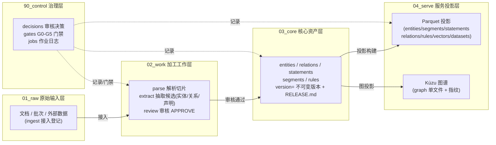
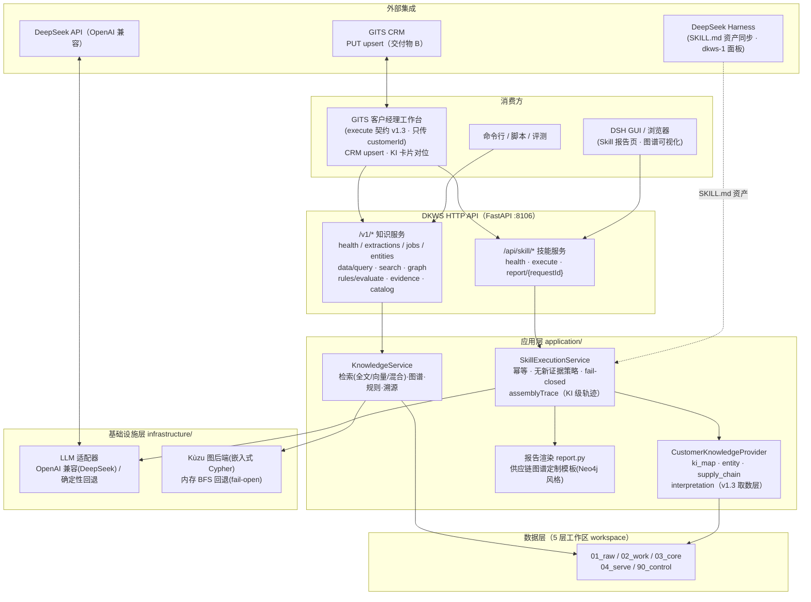
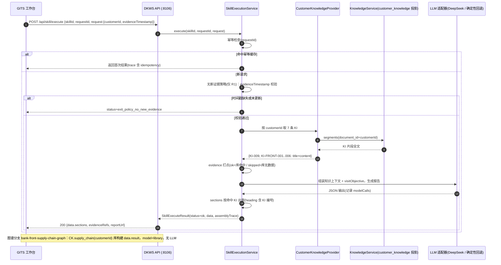
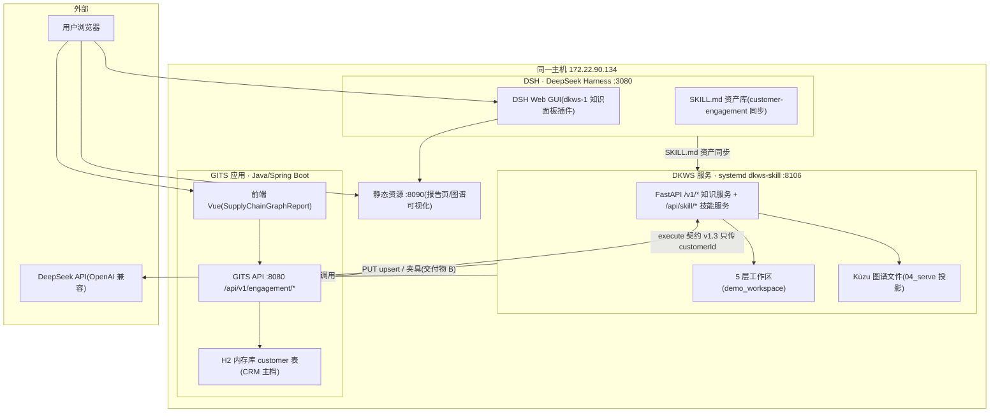

# DKWS 系统架构（文件目录型数据知识服务模拟平台）

> 版本：2026-08-22（对齐 v1.3 数据所有权改造）
> 依据：`文件目录型数据知识服务模拟平台_详细需求与详细设计_V1.0.md`（DKWS-SPEC-001）+ ADR（IMP-ADR-001~011）
> 图源：`dkws/docs/architecture.md`（Mermaid）；PNG 渲染：`dkws/docs/assets/dkws-architecture-*.png`

---

## 1. 总览：五层工作区 + 运行时服务

**分层职责**：01_raw 只收原始输入；02_work 是可重跑的加工现场（run_id 隔离）；
03_core 是**不可变版本化**的核心资产（发布即冻结）；04_serve 是面向查询/图谱/技能的
**可重建投影**（fingerprint 校验，Kùzu 为受控变更投影层，ADR-011）；90_control 全程
记录决策、门禁与作业审计。

## 2. 运行时服务架构（API → 应用 → 基础设施 → 数据/外部）

## 3. 核心组件与数据流

| 环节 | 组件 | 说明 |
|---|---|---|
| 接入 | `Ingestor` | 01_raw 登记批次，产出 DOC 登记（sha256 校验） |
| 解析 | `DocumentParserService` | 02_work 分段切片（heading 层级 + content_sha256） |
| 抽取 | `KnowledgeExtractor` | 实体/关系/声明候选（确定性 + 可选 LLM，CANDIDATE） |
| 审核 | `ReviewService` | 决策落 90_control/decisions，状态机 CANDIDATE→IN_REVIEW→APPROVED/REJECTED |
| 发布 | `Publisher` | 03_core 不可变版本（RELEASE.md + G3 门禁 + 幂等键含 run_id） |
| 投影 | `ProjectionBuilder` | 04_serve Parquet（x_* 扩展字段透传）+ Kùzu 图（ADR-011）+ fingerprint |
| 检索 | `KnowledgeService` | search（FULLTEXT/VECTOR/HYBRID）、data_query、get_entity、graph、evaluate_rule、trace |
| 图谱 | `_graph_kuzu` + `_graph_memory` | 邻接/闭包/路径（max_depth≤10，方向拆分防环路，fail-open） |
| 技能 | `SkillExecutionService` | 10 个 Skill（3 客户 + 7 bank-front 外部包）；幂等 TTL 10min；无新证据策略；fail-closed |
| 取数 | `CustomerKnowledgeProvider` | v1.3：按 customerId 读 KI 片段/实体/图谱（数据所有权在 DKWS） |
| 报告 | `report.py` | `/api/skill/report/{id}` 定制图谱报告（vis-network，Neo4j 风格） |
| 模型 | `llm.py` | DeepSeek（环境注入密钥）/ 确定性回退（离线端到端） |

**黄金路径（数据）**：接入 → 解析 → 抽取 → 审核 APPROVE → 发布 → 投影（Parquet + Kùzu）→
查询 / 检索 / 规则 / 图谱 / 溯源。

**黄金路径（技能，v1.3）**：GITS 传 `customerId` → `CustomerKnowledgeProvider` 从
`customer_knowledge` 投影取 7 条 KI / 图谱 → evidence 打点（ok/skipped 只反映库命中）→
LLM 生成（可选，图谱为确定性库构建）→ `data.sections` 按 KI 出章 → GITS 按 heading 对位。

## 4. 关键架构约束（DKWS-SPEC-001 / ADR）

- **文件目录为权威源**：本体 FS（03_core）+ 投影（04_serve）可重建；无隐藏数据库（§18.5）。
- **受控变更例外**：Kùzu 作为**可重建投影层**（IMP-ADR-011，6 条边界），非权威源。
- **数据所有权（v1.3）**：知识全在 DKWS；GITS 只传 `customerId`（+ 可选时间戳/拜访意图）。
- **fail-open / fail-closed**：知识检索失败 fail-open；模型输出不合格 fail-closed（无残缺半成品）。
- **可观测**：assemblyTrace（KI 级，含 kiId）、jobs 作业日志、G0-G5 门禁报告。

---

## 5. 时序图：GITS 调用 execute 完整链路（v1.3）

PNG：`docs/assets/dkws-sequence-execute.png`

## 6. 部署拓扑图（8106 / DSH / GITS / H2）

PNG：`docs/assets/dkws-deployment-topology.png`

**部署要点**：
- 全部同机（172.22.90.134）：DSH Web（:3080）、DKWS 服务（:8106，systemd 用户服务，Restart=always）、
  GITS API（:8080）+ 前端、静态资源（:8090）。
- **H2 为内存库**：GITS 重启后须重新 upsert / 重灌 `gits-crm-customer-master.json`（造数脚本幂等）。
- 数据流：GITS API → DKWS execute（v1.3 只传 customerId）；DKWS → GITS `PUT /api/v1/engagement/customer/{id}`
  同步 CRM 主档（交付物 B）；DKWS → DeepSeek API（LLM，密钥不落盘）。
