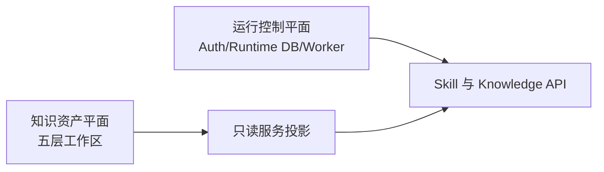

# DKWS 知识工程运行态独立架构评审报告

| 控制项 | 内容 |
|---|---|
| 文档编号 | `DKWS-ARCH-REVIEW-2026-08-26-001` |
| 文档版本 | `V1.0` |
| 评审日期 | `2026-08-26` |
| 评审角色 | Independent Enterprise AI Platform Architecture Reviewer / QA Gate |
| 评审对象 | DKWS 交接包、当前架构、v1.3/v1.4 契约、GITS 联调/UAT 结论、生产演进 Phase 1-5 |
| 强制产品边界 | DKWS 是可独立运行的服务端软件，不依赖任何 Agent Harness 或其他开发运行平台 |
| 证据原则 | 仅依据评审包；材料不足处标注“待补充” |

```text
GATE_DECISION=PASS_WITH_REQUIRED_CHANGES
DESIGN_REVIEW=COMPLETE
IMPLEMENTATION_VERIFICATION=PARTIAL
PRODUCTION_RELEASE_GATE=BLOCKED
GITS_UAT_PASS=NO
GITS_NEXT_OPTION=A+B
PHASE_1_DECISION=MODIFY_THEN_APPROVE
BASELINE_STATE=DRAFT_CANDIDATE / NOT_BASELINED
PRODUCTION_READY=NO
FROZEN=NO
```

> 本结论允许 Owner 批准“生产演进方向和整改开工”，不表示当前系统已生产可用、已通过 GITS UAT、已形成正式基线或已完成独立实施验收。

---

## 1. 评审结论摘要（TL;DR）

### 1.1 核心判断

1. **DKWS 的总体技术方向成立。** 五层工作区、`03_core` 权威资产、`04_serve` 可重建投影、知识接入—审核—发布—查询闭环，以及 Skill 执行、规则、图谱、证据溯源，足以支撑“知识工程运行态”的原型定位。
2. **当前不是生产级知识工程运行态。** 无鉴权、无 TLS、无限流、运行状态易失、异步线程任务不可恢复、无正式指标/追踪/告警、无受控密钥管理、无备份恢复和软件供应链门禁，均构成生产上线阻断。
3. **不需要推翻重构。** 应保留知识资产平面和五层文件模型，把持久化 Runtime Store、Worker、身份权限、LLM Gateway、可观测与运维控制作为独立运行控制平面增量加入。
4. **文件系统作为单机知识权威源可以接受，但有严格条件。** 仅适用于单写者、读多写少、不可变版本、原子切换、可校验哈希、受控本地持久盘，并且具备备份/恢复/容量/文件权限/磁盘故障处置。幂等、任务、审计、配额等高频可变运行状态不应继续依赖内存或散落文件，应进入 SQLite Runtime Store。
5. **独立服务边界目前没有完全闭合。** 核心 FastAPI 服务具备独立运行形态，但交接文档、配置变量、凭据注入、部署拓扑和 Skill 资产同步仍保留对外部开发运行环境的耦合。必须将其清理为“可选客户端/开发集成”，不能成为产品启动、密钥加载、Skill 注册或运行所需依赖。
6. **v1.3/v1.4 可用于继续联调，不足以作为生产合同。** 主要问题是无 API 版本、缺机器可验证 OpenAPI/JSON Schema、ContextPackage 权威 Schema 未包含在包内、异步 Job 契约不完整、未知字段静默忽略、幂等语义不完整、闸门放行依赖未经认证的客户端输入，以及文档之间存在多处漂移。
7. **`UAT_PASS=NO` 结论正确。** 即使 DKWS 自测全部通过，只要当前 GITS 分支没有真实调用 DKWS，就不能通过端到端 UAT。材料描述的根因“GITS 当前分支缺少 Skill HTTP 适配器和服务地址配置”逻辑成立，但评审包未包含 GITS 源码、分支差异和 UAT 原始日志，因此根因的独立复核状态为“待补充”。
8. **Owner 应选择 A+B。** 先实施 B：撤销 DKWS 所有权能力的本地 Mock/H2 拼装并 fail-closed；同时实施 A：在独立合同 Loop 中恢复真实 GITS→DKWS HTTP 适配器并完成端到端 UAT。配置名应改为产品中性的 `DKWS_BASE_URL`，不再沿用外部运行环境命名。
9. **Phase 1 应“修改后批准”。** 在现有 Phase 1 之前增加 Phase 0：独立产品边界、合同单一事实源、ADR/状态重新基线、生产 NFR 和 GITS UAT 合同冻结。Phase 1 还须加入密钥管理、审计防篡改、SQLite 工程基线、备份恢复、CI/CD、SBOM/依赖扫描、容量与故障验收。

### 1.2 最终门禁意见

| 决策对象 | 评审意见 |
|---|---|
| 当前架构方向 | 有条件通过 |
| 当前实现作为“原型/联调底座” | 可继续使用 |
| 当前实现作为生产独立服务 | 不通过 |
| v1.3/v1.4 继续联调 | 有条件允许 |
| v1.3/v1.4 直接冻结为生产合同 | 不批准 |
| GITS 当前 UAT | `NO`，结论准确 |
| GITS 下一步 | 批准 `A+B`，B 先落地、A 紧接完成 |
| Production Evolution Plan | 修改后批准 |
| Phase 1 开工 | 完成 Phase 0 前置物后批准实施 |

---

## 2. 评审范围、证据充分性与状态语义

### 2.1 已审阅材料

本次已按建议顺序审阅：

- `HANDOVER.md`；
- `dkws/docs/handover-review-2026-08-26.md`；
- `dkws/docs/production-evolution-plan.md`；
- `dkws/docs/architecture.md`；
- `dkws/ADR.md`；
- `dkws/docs/skill-execute-api-contract.md`；
- `dkws/docs/skill-execute-api-contract-v1.4.md`；
- `dkws/docs/v14-joint-debugging-plan.md`；
- `dkws/README.md`；
- `文件目录型数据知识服务模拟平台_详细需求与详细设计_V1.0.md`；
- 补充审阅 `SKILL_PLATFORM_ARCH.md`、`REQUIREMENTS_MATRIX.md`、`v13-return-to-gits.md`、`gits-integration-samples-v14.md`、`architecture-review-gits-proposal.md`。

评审包 SHA-256：

```text
11b7df3a50005668d38569dfeb8bc7cfbb938f6812cbd0eac50d33981ec9de1d
```

### 2.2 证据局限

评审包包含 31 个文档/图片文件，但不包含：

- DKWS 源码快照与受控 commit；
- 依赖锁、构建产物、SBOM；
- 137/192/197+ 测试的原始报告和运行环境清单；
- 安全扫描、覆盖率、性能、恢复演练原始证据；
- GITS 当前分支源码、P24/P30 差异和 UAT 原始日志；
- GITS 侧声称为权威的 ContextPackage/DTO/附录合同。

因此：

- 设计一致性审查：`COMPLETE`；
- 文档所述实现能力审查：`PARTIAL`；
- 运行状态、测试通过、UAT 根因的独立复现：`NOT_VERIFIED / 待补充`。

### 2.3 状态分类

| 状态 | 本报告含义 |
|---|---|
| `CURRENT_DOCUMENTED` | 材料明确声称当前已实现或运行，但本包未提供源码/原始执行证据 |
| `DESIGNED_NOT_IMPLEMENTED` | 生产演进文档已有设计，材料明确列为未来阶段 |
| `MISSING` | 材料中没有形成可执行设计或合同 |
| `PENDING_EVIDENCE` | 可能已存在，但评审包不足以独立确认 |

### 2.4 材料内部冲突

| 冲突 | 材料表现 | 评审处理 |
|---|---|---|
| 需求/实现状态 | 详细规格与 `SPEC.md` 为 `DRAFT_CANDIDATE / IMPLEMENTED=NO`；README 又声明 `IMPLEMENTED_PENDING_QA`，交接文档声称 Phase/能力完成 | 以未基线、未独立 QA 为准；实现声称标记 `PENDING_EVIDENCE` |
| Skill 数量与 R1 状态 | README 部分章节写 10 个 Skill、R1 下线；后续材料写 12 个 Skill、R1 已恢复 | 以 2026-08-26 交接声明 12 个为当前叙述，但需健康响应和源码补证 |
| 端口与地址 | v1.3 契约写默认 8100；交接/联调为 8106；架构图仍保留失效主机地址 | 合同必须去除环境偶然值，统一配置化 |
| v1.3 数据所有权 | 文首与变更记录称旧 structuredFacts/knowledgeContext 被忽略；正文输入表和示例仍称执行器读取这些字段 | 生产合同前必须消除；当前不能据此生成唯一 GITS DTO |
| 独立运行边界 | 用户目标为独立服务；交接、部署、凭据和 Skill 资产说明仍与外部开发运行环境绑定 | 认定边界未闭合，列为 Blocker |
| 原始规格与生产演进 | 原始规格明确禁止 SQLite/数据库；生产计划引入 SQLite Runtime Store | 方向合理，但必须通过新 ADR 和 Owner 重新基线，不能静默覆盖 |
| API 图深度 | 原始 API 最大深度 3；ADR-011/实现叙述放宽到 10 | ADR 已解释技术变更，但对外合同没有完成统一 |
| Phase 1 Metrics | Phase 1 验收要求 `/metrics`，具体指标实现放在 Phase 2 | Phase 拆分需重排或明确 Phase 1 仅提供端点骨架 |
| SP-20 落库 | 集成设计建议建议书知识化进入 Core；最新交接明确当前只生成、不落权威库 | 当前状态按“不落 Core”处理；未来是否落库需 Owner 决策 |

---

## 3. 总体评分

评分以“生产级独立服务端软件”为尺度，不以原型演示尺度评分。

| 维度 | 分数/10 | 结论 |
|---|---:|---|
| 1. 总体架构 | 7.0 | 核心分层正确，可增量演进 |
| 2. 功能完整性 | 6.0 | 纵向闭环较完整，通用运行态能力不足 |
| 3. 安全 | 2.0 | 生产阻断 |
| 4. 可靠性与容错 | 3.0 | 关键状态和任务不可可靠恢复 |
| 5. 可观测性 | 2.5 | 仅基础日志/健康雏形 |
| 6. AI/LLM 治理 | 3.5 | 有候选/规则/引用意识，缺完整控制面 |
| 7. 知识源与工具框架 | 3.5 | 当前未产品化，未来接口仍需重构 |
| 8. 多租户与数据治理 | 2.0 | 尚未形成银行级控制 |
| 9. 部署与运维 | 3.0 | 单机可跑，生产工程体系不完整 |
| 10. 契约与兼容 | 4.0 | 可联调，不能冻结为生产合同 |
| 11. UAT 与下一步 | 5.0 | 失败结论正确，根因证据不足 |
| **总体生产成熟度** | **3.9/10** | **生产不通过** |

补充口径：若只评价“单机知识工程原型/联调底座”，成熟度约为 **7/10**。两项分数并不矛盾：前者评价生产责任，后者评价技术闭环。

---

## 4. 架构评审明细（11 个维度）

### 4.1 总体架构

**结论：有条件通过。**

#### 当前已有（文档声称）

- 五层工作区：Raw、Work、Core、Serve、Control；
- `03_core` 不可变版本为知识权威源；
- Parquet/Kùzu 属于可重建投影；
- 接入、解析、抽取、审核、发布、投影、回滚闭环；
- 同一应用服务被 CLI/HTTP 调用；
- 图谱不作为唯一事实源。

#### 评价

五层边界清晰，特别是 Core 与 Serve 的权威/投影分离，符合轻量知识工程运行态。文件系统作为单机权威源在以下条件同时成立时可接受：

1. 单写者、多读者；
2. Core 不可变、只由 Publisher 写；
3. 临时目录 + fsync + 同文件系统原子 rename；
4. CURRENT 指针原子切换；
5. 资产、Release、Projection 哈希重算；
6. 文件权限、磁盘加密、容量和 inode 监控；
7. 备份、异地副本和恢复演练；
8. 服务只读投影，不扫描 Work 候选；
9. 高并发可变状态另放 Runtime Store。

当前材料只覆盖其中一部分，生产部署条件“待补充”。

#### 是否需要推翻重构

不需要。建议采用“双平面”增量架构：



知识资产平面保留文件权威；运行控制平面用 SQLite 管理幂等、任务、租户、密钥索引和审计。SQLite 不是知识事实源，不违反 Core 权威原则，但需要 ADR 正式改变原规格“禁止任何数据库”的约束。

#### 独立服务边界

当前材料仍把外部开发运行环境写入产品架构、凭据来源、配置名、动态插件和 Skill 资产发现。生产版必须做到：

- `dkws-server`、`dkws-worker`、`dkws-admin` 可在干净主机/容器独立安装启动；
- Skill 资产随 DKWS 发布包自带并有版本/签名；
- 密钥只从 DKWS 自身配置/Secret Provider 获取；
- GITS 只是 API Consumer；可视化插件只是可选客户端；
- 移除产品运行对外部 session、插件注册表、用户目录凭据文件的依赖；
- GITS 配置改为 `DKWS_BASE_URL`、`DKWS_API_KEY` 等产品中性名称。

### 4.2 功能完整性

**结论：部分满足“知识工程运行态”；不满足通用生产运行态。**

| 能力 | 当前状态 | 评审 |
|---|---|---|
| 五层知识管道 | `CURRENT_DOCUMENTED` | 纵向闭环较完整 |
| 检索/图谱/规则/溯源 | `CURRENT_DOCUMENTED` | 具备服务雏形 |
| 固定 Skill Registry 与执行 | `CURRENT_DOCUMENTED` | 适合 12 个已知 Skill |
| 知识地图读取 | `PARTIAL` | trace/资产中有知识地图 ID，但没有通用 KnowledgeMap Registry/API/版本合同 |
| Skill 路由 | `PARTIAL` | 主要由调用方指定 skillId；SP-20 routeMode 只是内部检索策略，不是通用路由控制面 |
| Skill 运行 | `CURRENT_DOCUMENTED` | 同步/异步均有，但异步可靠性不足 |
| 工具调用 | `MISSING` | ToolRegistry 在 Phase 3，当前没有产品化工具调用框架 |
| 多知识源适配 | `PARTIAL` | 当前主要文件/Parquet/Kùzu；统一接口尚未实现 |
| 知识资产审核发布 | `CURRENT_DOCUMENTED` | 当前最强能力之一 |
| 通用 Agent 化 | `MISSING` | 也不是 DKWS 必须承担的自主规划职责；应提供受控工具/技能 API，而非内置无限自主 Agent |

“读取知识地图、SKILL 路由、Skill 运行、工具调用、多知识源访问”在当前版本中只有 Skill 运行和固定知识访问较完整，不能把 Phase 3 目标写成当前已有。

### 4.3 安全

**结论：生产阻断。**

无鉴权、无 TLS、无限流、监听 `0.0.0.0`、无请求体上限，任何一个都足以阻断跨主机生产上线，组合出现风险更高。尤其是：

- 未认证调用方可执行 Skill、读取客户知识、提交交互内容；
- 未认证调用方可向 gate audit 提交任意 `decidedBy/decision`；
- SP-20 UPDATE 直接信任请求中的 `gateState.passed`，可获得 `releaseBlockedUntil=[]`；
- 当前 audit 是镜像且非权威，但仍可能污染审计叙述；
- 日志脱敏有原则，缺少可验证字段策略和敏感数据测试证据。

#### 对 Phase 1 安全设计的评价

API Key、租户绑定、Skill/API/客户前缀授权、限流和 TLS 方向正确，但仍缺：

- 密钥生成、轮换、吊销、双 Key 平滑切换和应急失效；
- Secret Provider 抽象（操作系统凭据、Vault/KMS 类服务或容器 Secret）；
- Key Hash 算法、参数与防离线破解策略；
- HMAC 签名所需 secret 的安全保存模型；当前只保存 Key hash 无法直接完成签名；
- nonce 原子消费、时钟同步和重放审计；
- CORS 默认关闭/白名单、Host 校验、请求体上限、上传炸弹、读取/写入超时；
- 服务身份与人员身份分离；
- 管理面与业务面端点分离；
- mTLS 或内网服务身份的可选方案；
- 文件权限、磁盘加密、备份加密；
- SAST、依赖漏洞、许可证、SBOM、镜像扫描和签名；
- 审计日志防篡改、导出和保留策略。

生产 profile 必须 fail-fast：若对外监听而 `auth_enabled=false`，服务应拒绝启动，不能依赖“默认值保持当前行为”。

### 4.4 可靠性与容错

**结论：生产阻断。**

#### 当前问题

- requestId 幂等缓存位于内存，重启清空；
- evidence timestamp 位于进程内存，重启后语义改变；
- SP-20 异步任务依赖线程，崩溃丢失；
- Job 文件与内存状态混用；
- reportUrl 依赖 10 分钟缓存；
- Kùzu 不可用时自动回退内存 BFS，但结果能力/深度/性能等价性未形成合同。

#### SQLite Runtime Store + Worker

该方向适合单机生产，但现有设计必须补齐：

- SQLite `WAL`、`busy_timeout`、同步级别、文件权限、磁盘满处理；
- Schema migration/version 和回滚；
- 事务性 Job claim（`lease_owner/lease_until/attempt`），避免多个 Worker 重复领取；
- 幂等主键至少为 `tenant_id + operation + request_id`；
- 存储 canonical request hash；同 key 不同 payload 必须 `409 IDEMPOTENCY_CONFLICT`；
- `PENDING/RUNNING/SUCCESS/FAILED/DEAD/CANCELLED` 的严格转换；
- at-least-once 语义、外部副作用幂等和重试边界；
- 结果大小上限、大结果文件引用及校验哈希；
- 备份时 Runtime DB 与 Core/CURRENT 的一致性点；
- 数据库损坏恢复、断电和磁盘满故障注入。

当前 `evidence_state(customer_id PRIMARY KEY)` 粒度不足。至少需要租户、客户、Skill/证据域、知识快照版本，并应优先使用 `core_release/version/hash` 或 source snapshot，而不是只信任调用方时间戳。

#### 是否需要消息队列或 PostgreSQL

- **Phase 1-2 不需要外部消息队列。** SQLite 持久队列足以支撑单实例、低到中等并发，前提是事务 claim 和 lease 完整。
- **PostgreSQL 不应“一步到位”成为默认。** 当出现多实例、独立 Worker 横向扩展、持续写竞争、严格 HA/RPO 或组织标准强制时再切换。
- **消息队列只在明确触发条件下引入**：跨主机消费、吞吐远超 SQLite、需要独立扩缩容、长积压、消息重放/隔离 SLA。不能为“未来可能”提前增加复杂度。

### 4.5 可观测性

**结论：当前不足；Phase 2 方向基本正确。**

当前日志、Job 状态、health 和 assemblyTrace 只能支持开发排错，不足以支撑生产运行。Metrics/Tracing 设计覆盖 HTTP、Skill、LLM、队列和知识源，方向合理，但缺少：

- SLI/SLO：可用率、延迟、成功率、任务完成时限、证据新鲜度；
- 告警规则和分级、通知链、值班/升级机制；
- 仪表盘和运行手册；
- 日志/指标/Trace 保留期与容量；
- 成本预算、预算告警、按 Skill/租户归集；
- 数据质量与投影新鲜度指标；
- 备份失败、磁盘使用率、inode、锁等待、SQLite WAL 增长告警；
- 高基数标签控制。

OpenTelemetry 中不能简单把任意 `requestId` 当作 `trace_id`；应生成符合规范的 Trace ID，并把 requestId 作为业务 correlation attribute/baggage。

`assemblyTrace` 应继续保留，但它是业务可读轨迹，不应替代系统 Trace。建议将其从自由字符串升级为稳定结构：`stepId/parentStepId/phase/component/status/start/end/duration/sourceRefs/assetVersion/policyId/errorCode/redactedMessage`。

### 4.6 AI/LLM 治理

**结论：有正确雏形，生产控制面不完整。**

#### 已有积极设计

- 模型输出先作为候选；
- SP-20 有事实标签、引用、unknown、limitations、双版本和规则；
- SP-21 候选记忆交由 GITS 人工确认；
- 有结构化输出、modelCalls、确定性规则和 fail-closed 意识；
- 模型内容与控制指令分离的设计原则正确。

#### 缺失项

- Prompt Template ID、版本、hash、审批状态和回滚；
- 模型 allowlist、版本/快照、参数 hash；
- 评测集、回归基线、红队和上线阈值；
- 输入/输出 Guardrails、敏感信息检测和内容安全策略；
- 引用覆盖率、事实一致性、未知项率、幻觉率的可测口径；
- Token/成本预算的阻断策略与告警；
- LLM 请求/响应留存、脱敏、保留和审计策略；
- provider outage、限额、模型漂移和回退策略；
- 章节级重试后跨章事实一致性检查；
- SP-21 记忆抽取的误合并、否定、时效和敏感记忆治理测试。

#### 确定性回退

确定性回退可用于：

- 离线测试；
- 图谱/规则/模板装配等本来就是确定性的能力；
- 明确设计为降级结果的只读辅助输出。

它不能被视为 generative Skill 的等价生产方案。SP-20/SP-21 若模型不可用：

- 要么 fail-closed；
- 要么返回明确 `DEGRADED`、`degradationReason`、`capabilityLoss`，并禁止对客放行/记忆自动确认；
- 不得以顶层 `ok` 和普通 `SUCCESS` 隐藏模型降级。

### 4.7 知识源与工具框架

**结论：当前未产品化；Phase 3 需实质修订。**

#### KnowledgeSource

统一接口方向正确，但 `query(statement: str)` 过于宽泛，容易演变成任意 SQL/Cypher/查询语言入口。生产接口应按 capability 拆分并使用受控 QuerySpec/注册 Query ID：

```text
search(SearchRequest)
get(GetRequest)
graph(GraphRequest)
execute_registered_query(query_id, parameters)
```

`SourceResult` 不能只有 records/meta，还应包含：

- source ID/type/version；
- snapshot/release/hash；
- evidence/provenance refs；
- tenant/security classification；
- freshness/effective time；
- pagination/truncation；
- policy decision ID；
- partial/degraded 状态；
- schema version。

SQL 必须是注册模板或受控 AST，不接受调用方原始 SQL。HTTP Source 必须域名/方法/路径白名单、防 SSRF、超时、响应大小、TLS 校验和凭据隔离。

#### ToolRegistry

当前 `permission: str` 不足以支撑 Agent 化。至少需要：

- 默认拒绝的 Policy Decision；
- 调用者、租户、客户/资源范围；
- 只读/写入/外部副作用风险级别；
- 输入/输出 Schema 和大小限制；
- 超时、重试、幂等和熔断；
- 网络 egress 白名单；
- Secret 引用而非明文；
- 沙箱/进程隔离和 CPU/内存限制；
- 人工批准要求；
- 工具版本、供应商、审计和停用开关；
- side-effect receipt/compensation。

“按 Skill 策略 fail-open 或 fail-closed”必须改为每个工具/步骤显式契约，涉及客户事实、对客输出、写操作和权限时默认 fail-closed。

#### 知识地图与路由

Phase 3 目标提到读取知识地图和 Skill 路由，但没有设计通用 `KnowledgeMapRegistry / RoutePolicy / ActivationPlan`。当前 caller 直接传 skillId，SP-20 的 routeMode 只是内部检索选择。应增加：

- KnowledgeMap ID/版本/资产引用；
- Skill/Tool/Source capability catalog；
- RoutePolicy 的输入、优先级、歧义拒绝和默认拒绝；
- ActivationPlan 的资产/Skill/工具/权限/版本快照；
- 可重放 plan hash；
- 同优先级歧义 fail-closed。

### 4.8 多租户与数据治理

**结论：银行级场景不满足；现有演进顺序需调整。**

“先列级租户、后目录级租户”对文件权威架构风险较高：它只能隔离投影/Runtime DB，无法天然隔离 Raw、Work、Core、Control 和文件访问。一次遗漏过滤就可能跨租户泄露，并留下二次迁移技术债。

建议：

1. Phase 1 明确只支持**单租户生产 profile**；
2. Runtime DB 从第一天保留 tenant_id，但固定为受控单租户值；
3. 真正启用多租户时，直接采用目录命名空间：`tenants/<tenant_id>/01_raw...90_control` 或独立工作区根；
4. 投影和所有主键同时包含 tenant_id；
5. 跨租户共享知识通过显式共享资产层和授权实现，不通过目录混读；
6. 增加跨租户渗透/属性测试，禁止裸 Repository 查询。

数据分级/脱敏设计只有通用四级示例，是否满足银行制度“待补充”。以下内容不能推迟到 Phase 4 才开始：

- 基础分类与字段标签；
- 日志/Trace/Prompt/LLM 请求脱敏；
- 单租户访问边界；
- 审计事件；
- 备份加密；
- 数据保留和法律保全接口。

Core 不可变与数据删除之间存在设计冲突。需要明确 tombstone、重建投影、备份到期删除、法律保全、加密擦除或版本撤销策略。`180 天/30 天` 等保留期不能由架构文档自行决定，须以银行制度、合同和监管要求为权威输入，目前为“待补充”。

### 4.9 部署与运维

**结论：当前演示级；systemd→Compose 不是生产成熟度的充分条件。**

systemd 和 Docker Compose 都可以支撑单机生产，关键不是工具名称，而是是否具备：

- 可重复构建和不可变发布物；
- 环境隔离和 Secret 注入；
- 服务账户、最小权限、文件 ACL；
- 配置校验和变更审计；
- 数据/Runtime DB/证书备份恢复；
- 升级、数据库迁移、回滚和兼容矩阵；
- 健康检查、SLO、告警、运行手册；
- 容量、磁盘和日志轮转；
- CI/CD、依赖/SBOM/镜像扫描和签名；
- 灾备演练。

建议 Owner 只选一个主要生产 profile。若团队具备容器运维能力，推荐 Docker Compose 作为可重复单机基线，systemd 仅保留开发/兼容模式；若银行已有成熟 systemd 发布体系，也可反向选择。两种模式都必须走相同验收。

现有 Compose 示例还存在细节缺口：`python:3.11-slim` 通常不自带 curl，但 healthcheck 使用 curl；证书生命周期、只读根文件系统、capability、资源限制、日志驱动、volume 备份、镜像 digest 固定均未设计。

### 4.10 契约与兼容

**结论：开发联调可用，生产合同不完整。**

#### v1.3

| 项 | 评价 |
|---|---|
| execute 主端点 | 已明确 |
| 顶层响应 | 已明确基本字段 |
| 数据所有权 | 方向明确：单客户知识在 DKWS |
| assemblyTrace | 有基本结构，但大量自由文本、不足以稳定消费 |
| 供应链图谱 | 有结果字段说明，但缺机器 Schema、分页/大小/证据完整定义 |
| 幂等 | 有短窗行为，但缺 payload hash、冲突、跨重启 |
| 错误 | 基本列出；业务错误始终 200 需调用方双重判断 |
| 版本 | 无 URL/Header 版本，无正式弃用机制 |
| 请求严格性 | unknown 字段被忽略，容易隐藏拼写和双方漂移 |
| 生产适用性 | 不通过 |

正文对旧字段“读取/忽略”存在矛盾，完整示例仍传旧字段，必须修订后才能生成 GITS DTO。

#### v1.4

| 项 | 评价 |
|---|---|
| SP-20 | 业务结果轮廓较完整；factLabels/citations/gates 仍需强 Schema |
| SP-21 | 候选/强化/取代边界清晰；需增加人工确认语义与敏感数据策略 |
| ContextPackage | 权威 Schema 位于 GITS 文件，但不在包内，`待补充` |
| Async Job | 202+轮询方向合理；缺 cancel、expiry、Retry-After、进度、稳定错误 envelope |
| 闸门清单 | 可作为只读知识资产 |
| 闸门 audit | 未认证且接受 caller 自报 decidedBy，不能作为生产审计证据 |
| 放行控制 | DKWS 信任 request 中 passed gates，不能单独阻止伪造放行 |
| 兼容性 | 文档宣称向后兼容，但 auth/严格校验/持久 Job 都会改变可观察行为 |

`result.status=PARTIAL` 同时顶层 `status=ok` 容易被误消费。至少要提供明确的 `usable=false / releaseAllowed=false`，并在 GITS 适配器中强制判断；生产 v2 可把规则阻断映射到稳定顶层状态。

#### assemblyTrace / 供应链图谱 / SP-20 / SP-21 / 闸门

| 对象 | 是否有文档契约 | 是否足够生产 |
|---|---|---|
| assemblyTrace | 有 | 否；字段弱、无版本、无稳定来源/时序/错误结构 |
| 供应链图谱 | 有部分字段 | 否；缺完整 JSON Schema、限制、分页、证据/时态规范 |
| SP-20 | 有增量说明和样例 | 否；ContextPackage、claim/citation、放行信任边界不完整 |
| SP-21 | 有增量说明和样例 | 否；需敏感记忆、冲突、人工确认、重试幂等合同 |
| Gate 清单 | 有 | 可作为只读资产，但需版本/hash |
| Gate audit | 有 | 否；不具认证、防伪、幂等和权威审计属性 |

#### 兼容演进建议

1. 以 OpenAPI 3.1 + JSON Schema 建立单一事实源，文档从合同生成；
2. 发布 `contractVersion`、`serviceVersion`、`schemaVersion`；
3. 生产加强版使用 `/api/v2/...`，v1 保留有期限兼容层；
4. v2 默认 unknown fields 拒绝；v1 可继续忽略但记录 warning；
5. auth、401/403/429、body limit、timeout 作为明确客户端迁移项；
6. 建立 consumer-driven contract test，DKWS 与 GITS 在同一版本矩阵验证；
7. 每次变更给出 breaking/non-breaking 分类、弃用期和回滚策略。

### 4.11 UAT 结论与下一步

**结论：`UAT_PASS=NO` 准确。**

UAT 判断依据是端到端业务链是否真实经过 DKWS，而不是 DKWS 自身测试是否绿色。材料明确称当前 GITS 页面使用本地知识快照、Mock LLM、H2 规则或空壳，不会调用 DKWS，因此不能通过。

材料所述根因“P30 分支未包含 P24 Skill HTTP 适配器，且无 base URL 配置”与现象一致，但由于包内没有 GITS 代码、commit、配置和调用日志，该根因只能标为：

```text
ROOT_CAUSE_ASSESSMENT=PLAUSIBLE_NOT_INDEPENDENTLY_VERIFIED
MISSING_EVIDENCE=GITS_BRANCH_DIFF + RUNTIME_CONFIG + HTTP_TRACE + UAT_LOG
```

#### Option 对比

| 选项 | 收益 | 风险 | 单独是否足够 |
|---|---|---|---|
| A：恢复真实 HTTP 路径 | 恢复知识所有权和真实能力，能够进行 E2E | 若不先清理本地 fallback，故障时仍可能返回伪成功；还要处理认证/超时/契约漂移 | 否 |
| B：先 fail-closed 空态 | 立即停止 Mock/H2 冒充 DKWS 结果，保护事实和 UAT 真实性 | 功能仍不可用，只是正确失败 | 否 |
| A+B | 同时保证“真调用”和“失败不伪造” | 需要一次受控合同/适配器 Loop 和完整 E2E | **是，推荐** |

#### 推荐执行顺序

1. **B 先落地**：DKWS-owned capability 在未配置、不可达、超时、认证失败、合同错误时显示明确空态；不得本地拼装同名结果；
2. **A 紧接实施**：恢复 GITS `SkillExecutionPort/ProposalPort/InteractionMemoryPort` 的 DKWS HTTP Adapter；
3. 配置统一为 `DKWS_BASE_URL`，不要使用 DHCP 地址作为生产配置；
4. consumer contract tests 覆盖 v1.3/v1.4；
5. 最终 HEAD 上执行真实 E2E：R1、供应链图谱、assemblyTrace、SP-20 async、SP-21、Gate；
6. 注入 DKWS 不可达/超时/404/422/PARTIAL/Job FAILED，证明 fail-closed；
7. 形成 GITS 与 DKWS 两侧同一 trace/requestId 的证据包后再重新 UAT。

---

## 5. 发现的阻断项（Blocker）

| ID | 发现 | 影响 | 概率 | 严重度 | 必须动作 | 关闭证据 |
|---|---|---|---|---|---|---|
| `B-01` | 无鉴权、无 TLS、无限流、无 body limit，且监听可跨主机访问 | 客户知识泄露、未授权 Skill 执行、资源耗尽 | 高 | 严重 | Phase 1 完成认证、授权、TLS、限流、大小/超时控制；生产配置 fail-fast | 安全测试、DAST、配置审计、真实 401/403/429/413 证据 |
| `B-02` | 幂等/evidence/异步任务易失；gate audit 和 passed gates 可由未认证调用方自报 | 重启重复执行、错误放行、审计污染、任务丢失 | 高 | 严重 | Runtime Store、事务 Job lease、幂等 payload hash、认证与权威 gate token/查询 | 重启/并发/篡改/重放/断电测试 |
| `B-03` | 独立服务边界未闭合，运行说明仍依赖外部开发运行环境的配置、凭据和 Skill 同步 | DKWS 无法作为独立产品安装、升级、审计和支持 | 高 | 严重 | Phase 0 清理产品依赖，独立发行、配置、Secret、Skill 包和服务名 | 干净主机/容器离线安装启动与功能验证 |
| `B-04` | v1.3/v1.4 没有机器合同 SSOT，ContextPackage 缺失，文档内存在字段/端口/版本矛盾 | GITS DTO 漂移、误解析、无法证明兼容 | 高 | 严重 | OpenAPI/JSON Schema 基线、合同版本、consumer tests、冲突清零 | DKWS/GITS 双方同一合同 hash 与测试报告 |
| `B-05` | 评审包无源码/commit、原始测试/扫描/运行证据 | 无法独立确认“已实现、137 全绿、服务健康” | 中 | 严重 | 补受控实现审计包并由独立 QA 复跑 | commit、manifest、测试、覆盖率、安全、运行日志 |
| `B-06` | GITS 当前未真实调用 DKWS | 端到端业务链不存在，UAT 不能通过 | 高 | 严重 | 执行 A+B，最终 HEAD 真实 E2E | 两侧 trace、HTTP 证据、UI 结果、故障空态、Owner UAT |

生产上线必须关闭全部 Blocker；Phase 1 开工不要求先关闭全部，但须先关闭 `B-03/B-04` 的设计前置部分并建立每项 Owner。

---

## 6. 高优先级问题（Major）

| ID | 问题 | 影响 | 概率/严重度 | 建议动作 |
|---|---|---|---|---|
| `M-01` | 状态标签、Skill 数量、R1 状态、测试数量、端口/IP 多文档漂移 | 交接、发布和故障定位失真 | 高/高 | 建立受控状态清单与生成式 README，清理历史内容或明确 superseded |
| `M-02` | 原始规格禁止 DB，生产设计引入 SQLite，尚无 Owner ADR/基线更新 | 设计越权与测试口径冲突 | 高/高 | 增加 ADR-012 并更新规格、矩阵、验收口径 |
| `M-03` | idempotency 表只按 request_id，未绑定租户/操作/payload hash/in-progress | 键碰撞、重复副作用、错误结果复用 | 高/高 | 复合主键/唯一约束、canonical hash、冲突 409、原子状态机 |
| `M-04` | evidence_state 只按 customerId 与 timestamp | 跨 Skill/租户污染、客户端时间伪造、重启语义变化 | 高/高 | 用知识 release/snapshot/hash + tenant/customer/skill scope |
| `M-05` | Worker 缺原子领取、lease、取消、幂等副作用和 result 大小策略 | 重复执行或任务永久 RUNNING | 中/高 | 完整 Job 状态机与故障注入 |
| `M-06` | LLM Gateway 缺 Prompt 版本、评测、Guardrails、预算阻断和模型漂移治理 | 幻觉、泄密、成本与质量不可控 | 高/高 | 建 Prompt Registry、Eval Gate、Model Policy、预算/告警 |
| `M-07` | 确定性回退可能被当作 generative Skill 普通成功 | 业务误用降级内容 | 中/高 | Skill 级 fallback policy；显式 DEGRADED 或 fail-closed |
| `M-08` | KnowledgeSource 接收自由 statement，结果缺来源/版本/敏感度 | 任意查询、证据断链和数据越界 | 高/高 | typed capabilities、registered query、SourceResult provenance |
| `M-09` | ToolRegistry 权限模型仅单字符串，允许策略 fail-open | 工具越权、SSRF、外部副作用 | 高/高 | Policy engine、沙箱、egress、Secrets、risk class、人工批准 |
| `M-10` | 多租户先列级后目录级 | 跨租户泄露和二次迁移 | 中/高 | 单租户先生产；启用多租户时直接目录命名空间 |
| `M-11` | 不可变 Core 与删除/保留/法律保全未统一 | 无法执行合规删除或保持审计 | 中/高 | 制定生命周期、tombstone、备份删除、legal hold 与证明 |
| `M-12` | 无 CI/CD、SBOM、供应链安全、镜像签名和依赖锁证据 | 不可重复发布、依赖漏洞进入生产 | 高/高 | 加入 Phase 1 交付和 Gate |
| `M-13` | 备份/恢复/升级回滚只在远期概述 | 单机故障可能丢失权威资产和审计 | 中/高 | Phase 1 建 SOP、备份、恢复演练和 RPO/RTO |
| `M-14` | Metrics 无 SLO、告警、仪表盘、成本预算 | 故障只能由用户发现 | 高/中 | Phase 2 完整运维闭环，Phase 1 先具备关键告警 |
| `M-15` | SP-20 信任 GITS 传入 gateState，可生成可放行对客版 | 伪造审批状态导致对客风险 | 中/高 | 使用认证服务身份 + 权威 gate assertion/token/API；DKWS 不信任自由字段 |
| `M-16` | DKWS 知识与 GITS 业务事实冲突优先级写法不清 | 旧知识可能覆盖最新业务事实 | 中/高 | 建立 Source Authority/时态/冲突合同，不用“DKWS 总是优先” |

### 6.1 主要发现证据定位

| 发现 | 主要材料与章节 |
|---|---|
| `B-01` | `skill-execute-api-contract.md` §1/§8；`skill-execute-api-contract-v1.4.md` §5；`v14-joint-debugging-plan.md` §1；`production-evolution-plan.md` §3.2/§4.1 |
| `B-02` | `skill-execute-api-contract.md` §7；`handover-review-2026-08-26.md` §4.6/§4.9；`skill-execute-api-contract-v1.4.md` §2.2/§4；`production-evolution-plan.md` §4.3/§5.1 |
| `B-03` | `HANDOVER.md` 文首/§3.4/§5；`architecture.md` §2/§6；`README.md`“DSH 集成”；`SKILL_PLATFORM_ARCH.md` §1-§2/§8 |
| `B-04` | `skill-execute-api-contract.md` §2-§3/§8/§10；`skill-execute-api-contract-v1.4.md` §2/§5；`gits-integration-samples-v14.md` §2-§6 |
| `B-05` | `handover-review-2026-08-26.md` §3/§4.8；评审包文件清单 |
| `B-06` | `HANDOVER.md` §3.5/§8.1；`handover-review-2026-08-26.md` §3.4/§5.3/§6 |
| `M-01/M-02` | `SPEC.md`；详细需求与设计 §1/§24；`README.md`“阶段状态/客户经理持续经营 Skill”；`REQUIREMENTS_MATRIX.md` §1/§3；`production-evolution-plan.md` §4.3 |
| `M-03/M-04/M-05` | `production-evolution-plan.md` §4.3/§5.1；`skill-execute-api-contract.md` §7 |
| `M-06/M-07` | `production-evolution-plan.md` §5.2-§5.3；`HANDOVER.md` §5；`README.md`“客户经理持续经营 Skill 平台” |
| `M-08/M-09` | `production-evolution-plan.md` §6.1-§6.5 |
| `M-10/M-11` | `production-evolution-plan.md` §7.1-§7.3；详细需求与设计 §16.3 |
| `M-12/M-13/M-14` | `handover-review-2026-08-26.md` §4.2/§7；`production-evolution-plan.md` §3.2/§4-§5/§8 |
| `M-15` | `skill-execute-api-contract-v1.4.md` §3.2/§4；`gits-integration-samples-v14.md` §4；`v14-joint-debugging-plan.md` L-10 |
| `M-16` | `architecture-review-gits-proposal.md` §3.2 |

### 6.2 整改责任分配

| 发现范围 | 责任工作流 | 复核方 |
|---|---|---|
| `B-01`、`M-12` | DKWS Security/DevOps | Independent Security QA |
| `B-02`、`M-03`—`M-05` | DKWS Runtime Tech Lead | Reliability QA |
| `B-03`、`M-01`—`M-02` | DKWS Architecture/Baseline Owner | Architecture Review |
| `B-04`、`M-15`—`M-16` | DKWS/GITS Contract Owners | Consumer Contract QA |
| `B-05` | Release/QA Evidence Owner | Independent QA |
| `B-06` | GITS Integration/UAT Owner | Independent E2E QA + Owner UAT |
| `M-06`—`M-07` | AI/Knowledge Engineering Lead | Model/Evaluation QA |
| `M-08`—`M-09` | Knowledge Runtime/Tooling Lead | Security + Architecture QA |
| `M-10`—`M-11` | Data Governance/Compliance | Compliance Review |
| `M-13`—`M-14` | Operations/SRE | Reliability QA |

---

## 7. 改进建议（Minor / Nice-to-have）

| ID | 建议 | 级别 |
|---|---|---|
| `N-01` | 统一 HTTP 错误 envelope；明确业务失败使用 4xx/5xx 还是 200+status 的稳定规则 | MINOR |
| `N-02` | reportUrl 明确为非合同调试资源，增加不可猜测 token/授权或生产关闭 | MINOR |
| `N-03` | `/api/skill/health` 修正写死的 service 名，并返回版本/contract hash/capability health | MINOR |
| `N-04` | 去除文档中的固定 IP、失效地址和环境偶然值，使用配置占位符 | MINOR |
| `N-05` | `livez` 不应写“永远 200”，应保证事件循环可响应；`readyz` 做依赖分级 | MINOR |
| `N-06` | 路由路径指标使用模板化 route，避免 customerId/jobId 形成高基数 | MINOR |
| `N-07` | 为图谱大结果增加分页/最大节点/最大边/最大响应字节和异步导出 | MINOR |
| `N-08` | 为 ContextPackage 与 ServiceResult 增加压缩/大小计算口径及字符集规范 | MINOR |
| `N-09` | 将平台 Gate 与业务 Gate 前缀永久分离为 `GATE-PLATFORM-*` / `GATE-BIZ-*` | MINOR |
| `N-10` | Skill/资产/模型/Prompt/规则版本进入每次响应 RunManifest | NICE_TO_HAVE |

---

## 8. 生产演进设计评审（Phase 1-5）

### 8.1 建议新增 Phase 0：产品边界与基线收敛

**现有计划遗漏，必须增加。**

| 工作项 | 退出标准 |
|---|---|
| 独立产品边界 | 干净环境无需外部 Harness 即可安装、启动、发现 Skill、加载配置/密钥 |
| 状态与权威文档 | 规格、ADR、README、Handover、矩阵无矛盾；明确 superseded 文档 |
| 合同 SSOT | OpenAPI 3.1 + JSON Schema + examples + contract hash；ContextPackage 纳入包 |
| 架构 ADR | SQLite Runtime Store、独立服务、认证、部署 profile 获 Owner 决策 |
| 生产 NFR | SLO、RPO/RTO、容量、并发、数据分类、保留、支持平台明确 |
| GITS A+B 合同 | fail-closed 规则、Adapter、配置名、UAT 用例冻结 |

### 8.2 Phase 1：生产加固地基

**评价：方向正确，内容不完整，修改后批准。**

保留：API Key/TLS/限流、配置外部化、SQLite Runtime Store、结构化日志、健康检查、容器化。

必须补充：

- Secret 管理、轮换、吊销与生产 fail-fast；
- body/upload/response 大小、超时、并发、CORS/Host/egress；
- SQLite WAL、migration、权限、备份恢复和损坏演练；
- 幂等 request hash、in-progress、租户/操作 scope；
- 基础单租户隔离、数据分类、日志/LLM 脱敏；
- 审计事件防篡改和安全导出；
- CI/CD、依赖锁、SBOM、SAST/DAST、镜像扫描/签名；
- 升级回滚和兼容验证；
- 最小 SLO/告警、磁盘/备份告警；
- 基准负载与资源限制。

Phase 1 的 `/metrics` 与 Phase 2 冲突：可将 Phase 1 定义为最小运行/安全指标，Phase 2 扩展业务和 LLM 指标。

**修订后验收：** 除原 9 项外，增加 Secret 轮换、重启/断电/并发幂等、备份恢复、磁盘满、未认证审计篡改、依赖扫描、镜像重建一致性和 GITS auth E2E。

### 8.3 Phase 2：可靠执行与可观测

**评价：顺序合理，设计需加强。**

必须补充：

- Job 原子 claim/lease、取消、deadline、dead-letter、人工重放；
- at-least-once 与外部副作用幂等；
- Prompt Registry、Model Policy、Eval/Regression Gate；
- 结构化输出优先使用 provider schema/function capability，Pydantic 做最终校验；
- Guardrails、敏感内容、引用/事实一致性检查；
- Skill 级降级策略；
- SLO、告警、仪表盘、成本预算与预算阻断；
- Trace ID 与 requestId 正确映射；
- Metrics 高基数控制。

### 8.4 Phase 3：通用知识源与工具调用

**评价：产品化目标正确，当前接口不足，需重新详细设计。**

必须增加：

- typed KnowledgeSource capability 与注册查询；
- provenance/snapshot/security/freshness 完整 SourceResult；
- KnowledgeMap Registry、RoutePolicy、ActivationPlan；
- 工具 Policy、风险级别、沙箱、egress、Secret、人工批准、回执；
- SQL/HTTP/文件路径安全；
- 插件包签名、版本兼容和停用机制；
- Source/Tool contract tests 和故障注入。

首批不建议同时做 SQL、S3、向量库和任意外部 API。建议先完成 Parquet/Kùzu/受控 HTTP 三类，验证框架后再扩展。

### 8.5 Phase 4：多租户与数据治理

**评价：完整治理不能推迟至此，租户路径需调整。**

- Phase 1 前移基础数据分类、脱敏、审计和单租户边界；
- Phase 4 实施真正多租户时直接目录级 namespace，不采用“先共享目录只加列”作为正式生产方案；
- tenant_id 进入 Raw/Core/Serve/Control、Runtime DB、幂等、Job、审计和 Cache 全链；
- 增加共享知识资产授权模型；
- 补删除、retention、legal hold、备份到期、导出审批；
- 保留期由银行制度决定，当前数值只作候选。

### 8.6 Phase 5：高可用与规模化

**评价：作为远期方向可接受，尚不足以开工。**

必须先定义触发条件：

- API/Job 吞吐与并发；
- 单机 CPU/内存/磁盘阈值；
- 可用性 SLO；
- RPO/RTO；
- 租户数量和数据规模；
- Worker 积压与恢复时间。

多实例时需要 PostgreSQL、共享/对象存储、快照发布与分布式协调，但不要默认引入消息队列。Kùzu 应保持版本化只读快照投影，避免多个实例同时写同一图库。NFS/对象存储的一致性、原子 rename 等假设必须重新验证。

### 8.7 Phase 评审总表

| Phase | 方向 | 可执行性 | 结论 |
|---|---|---|---|
| 新 Phase 0 | 当前缺失 | 高 | 必须先做 |
| Phase 1 | 正确 | 中；需补安全/运维/数据治理 | 修改后批准 |
| Phase 2 | 正确 | 中 | 详细设计补强后实施 |
| Phase 3 | 正确但接口过宽 | 中低 | 重新详细设计 |
| Phase 4 | 目标正确、顺序部分不当 | 中低 | 基础治理前移，租户路径重做 |
| Phase 5 | 合理远期 | 低，取决于指标 | 保留候选，不立刻实施 |

---

## 9. 推荐路线图

### 9.1 0-3 个月：独立单机生产候选

优先顺序：

1. **Phase 0**：产品边界、状态基线、合同 SSOT、ADR、NFR；
2. **GITS A+B**：先 fail-closed，再恢复真实 Adapter，完成 UAT；
3. **Phase 1 修订版**：Auth/TLS/限流/Secret/SQLite/日志/备份/CI-CD/供应链安全；
4. **Phase 2 核心**：持久 Worker、LLM Gateway、强 Schema、最小 Eval/Prompt Registry；
5. **可观测闭环**：Metrics/Trace/SLO/告警/成本；
6. 独立 QA 在最终 commit 复跑，并形成单机生产试点 Gate。

0-3 个月目标状态只能是：

```text
TARGET=INTERNAL_SINGLE_NODE_PRODUCTION_CANDIDATE
TENANCY=SINGLE_TENANT
RUNTIME_STORE=SQLITE
EXTERNAL_MQ=NO
PRODUCTION_RELEASE=OWNER_AND_QA_GATED
```

### 9.2 3-6 个月：通用知识运行控制面

1. KnowledgeMap/Route/ActivationPlan；
2. typed KnowledgeSource Registry；
3. 受控 ToolRegistry（先内部只读工具）；
4. Prompt/Model/Eval/Guardrail 全治理；
5. 数据质量、证据新鲜度和成本运营；
6. 更大规模性能、恢复和安全测试。

### 9.3 6-12 个月：按业务需要扩展

1. 如确有多租户需求，实施目录级租户隔离和完整数据生命周期；
2. 根据真实瓶颈决定 PostgreSQL、多实例、对象存储或外部队列；
3. 建 active-passive/多实例方案与定期灾备演练；
4. 扩展受控 SQL、对象存储、向量库和外部 API；
5. 完成银行制度映射、合规审计和运营指标闭环。

---

## 10. 给 Owner 的决策建议

### 10.1 建议批准

1. 批准 DKWS 的产品定位：**独立运行、单机优先、文件知识权威源、SQLite 运行控制状态**；
2. 批准保留五层工作区、Core/Serve 边界和可重建投影，不做推翻式重构；
3. 批准新增 Phase 0；
4. 批准修改后的 Phase 1 范围和开工准备；
5. 批准 GITS 采用 `A+B`；
6. 批准首个生产候选为单租户、单节点；
7. 批准 Phase 1-2 不引入外部消息队列，SQLite 作为默认 Runtime Store；
8. 批准 OpenAPI/JSON Schema 成为契约单一事实源；
9. 批准独立 QA 只在最终 commit 和真实运行环境签署。

### 10.2 不建议批准

- 不批准当前版本生产上线；
- 不批准把 137/192/197+ 测试叙述当作独立 QA 证据；
- 不批准把 v1.3/v1.4 原文直接冻结为生产合同；
- 不批准继续依赖外部开发运行环境提供启动、密钥或 Skill 注册；
- 不批准无认证的 gate audit 或自由 gateState 作为对客放行依据；
- 不批准 generative Skill 在模型不可用时静默返回普通成功；
- 不批准先列级多租户作为银行正式隔离方案；
- 不批准未定义触发条件就引入 PostgreSQL、Redis、MQ 或多实例；
- 不批准在无真实 GITS→DKWS 调用时把 UAT 改为 PASS；
- 不批准仅以“Docker 化”替代备份、恢复、升级、回滚和安全治理。

### 10.3 Owner 建议决策块

```text
OWNER_DECISION_RECOMMENDATION=APPROVE_WITH_CONDITIONS
GITS_UAT_OPTION=A+B
PHASE_0=APPROVE
PHASE_1=MODIFY_THEN_APPROVE
DEPLOYMENT_TARGET=SINGLE_NODE_SINGLE_TENANT
KNOWLEDGE_AUTHORITY=VERSIONED_FILE_WORKSPACE
RUNTIME_STATE=SQLITE
EXTERNAL_MESSAGE_QUEUE=DEFER
POSTGRESQL=TRIGGER_BASED_FUTURE_OPTION
CURRENT_PRODUCTION_RELEASE=DENY
NEXT_GATE=PHASE_0_BASELINE_AND_CONTRACT_GATE
```

### 10.4 Phase 0 关闭后才允许的下一转换

```text
CURRENT: DRAFT_CANDIDATE / PROTOTYPE_RUNTIME
  → PHASE_0_PASS
  → READY_FOR_PHASE_1_IMPLEMENTATION
  → PHASE_1_MACHINE_GATES_PASS
  → READY_FOR_INDEPENDENT_SECURITY_AND_RELIABILITY_QA
  → OWNER_INTERNAL_PILOT_DECISION
```

不得从当前状态直接跳转到 `PRODUCTION_READY`。

---

## 11. 待补充材料清单

| ID | 待补充材料 | 用途 | Owner/责任方建议 |
|---|---|---|---|
| `ME-01` | DKWS 源码快照、commit、文件 manifest/hash | 独立验证实现 | DKWS Tech Lead |
| `ME-02` | Python 依赖锁、系统依赖、SBOM、许可证清单 | 供应链与可复现构建 | Build/Security |
| `ME-03` | unit/contract/integration/e2e/security/recovery 原始报告 | 验证测试声称 | QA |
| `ME-04` | 覆盖率、性能、并发、容量与资源基线 | 验证 NFR | QA/Performance |
| `ME-05` | systemd unit、启动脚本、配置清单、Secret 注入设计（脱敏） | 验证独立运行和密钥边界 | DevOps/Security |
| `ME-06` | GITS P24/P30 commit、branch diff、Adapter 和 application 配置 | 独立验证 UAT 根因 | GITS Tech Lead |
| `ME-07` | GITS Owner UAT 原始报告、请求日志、两侧 trace | 确认 UAT 事实 | GITS UAT Owner |
| `ME-08` | GITS 权威 v1.3 合同、ContextPackage 附录 A/B/C/D、DTO Schema | 合同闭合 | Contract Owner |
| `ME-09` | OpenAPI/JSON Schema 当前文件（若存在） | 机器契约审查 | DKWS/GITS Contract Owner |
| `ME-10` | 数据分类、保留、删除、审计和 LLM 数据使用制度 | 银行合规判断 | Data Owner/Compliance |
| `ME-11` | 目标 SLO、RPO、RTO、并发、吞吐、数据量、成本预算 | 生产架构定级 | Owner/Operations |
| `ME-12` | 备份恢复、升级回滚、磁盘满/断电演练证据 | 单机生产验收 | Operations/QA |
| `ME-13` | 安全测试、依赖扫描、SAST/DAST、镜像扫描报告 | 关闭安全 Blocker | Security QA |
| `ME-14` | SP-20/21 Prompt、模型、规则版本和评测基线 | LLM 治理审查 | AI/Knowledge QA |
| `ME-15` | 文件系统类型、挂载选项、加密、原子 rename/fsync 假设 | 文件权威源生产可行性 | Infrastructure |

在 `ME-01/03/06/07/08` 补齐前，不应签署正式实施 QA 或 GITS UAT；在 `ME-10/11/12/13/15` 补齐前，不应批准生产试点。

---

## 12. 关闭标准与后续评审

### 12.1 Phase 0 Gate

- 独立服务依赖清零；
- 合同 hash 与双方 consumer tests 一致；
- 文档状态冲突清零；
- ADR-012/013 及独立服务 ADR 获 Owner 决策；
- NFR/数据制度缺失项具备 Owner 或明确的 `PENDING_WITH_OWNER`；
- A+B 的用例和职责冻结。

### 12.2 GITS UAT 重跑 Gate

- 最终 GITS HEAD 真实调用最终 DKWS HEAD；
- R1、供应链、SP-20、SP-21、Gate/trace 全链证据；
- DKWS 不可达/超时/认证失败/PARTIAL 时 GITS 明确 fail-closed；
- 无 H2/Mock 冒充 DKWS-owned 结果；
- 证据包含 requestId、traceId、合同版本、双方 commit 和时间；
- Owner UAT 独立签署。

### 12.3 Phase 1 生产加固 Gate

- Blocker `B-01/B-02/B-03/B-04/B-05` 有机器关闭证据；
- 安全、重启、并发、断电、备份恢复、升级回滚测试通过；
- Secret、SBOM、依赖和镜像门禁通过；
- SLO/告警/运行手册就绪；
- 独立 QA 签署；
- Owner 决定是否进入受控内网试点。

---

## 13. 最终结论

DKWS 已经形成一个结构扎实的知识工程原型核心：文件化权威资产、不可变 Core、可重建 Serve、知识发布门禁、证据溯源以及面向银行场景的 Skill/规则/图谱链路，这些都值得保留。其生产演进应采用**增量加固**，而非重写。

但“知识工程运行态”若作为独立服务端软件，必须拥有自己的产品边界、身份安全、运行状态、任务恢复、契约版本、模型治理、可观测和运维体系。当前这些责任尚未闭合，因此本次结论是：

```text
ARCHITECTURE_DIRECTION=CONDITIONALLY_ACCEPTED
CURRENT_RUNTIME=PROTOTYPE_AND_INTEGRATION_BASE
PRODUCTION_READINESS=REJECTED
EVOLUTION_PLAN=MODIFY_THEN_APPROVE
GITS_UAT=NO
OWNER_RECOMMENDATION=A+B + PHASE_0 + REVISED_PHASE_1
```

这是一个可以继续建设、无需推翻，但必须先治理边界和合同、再谈生产的架构。
