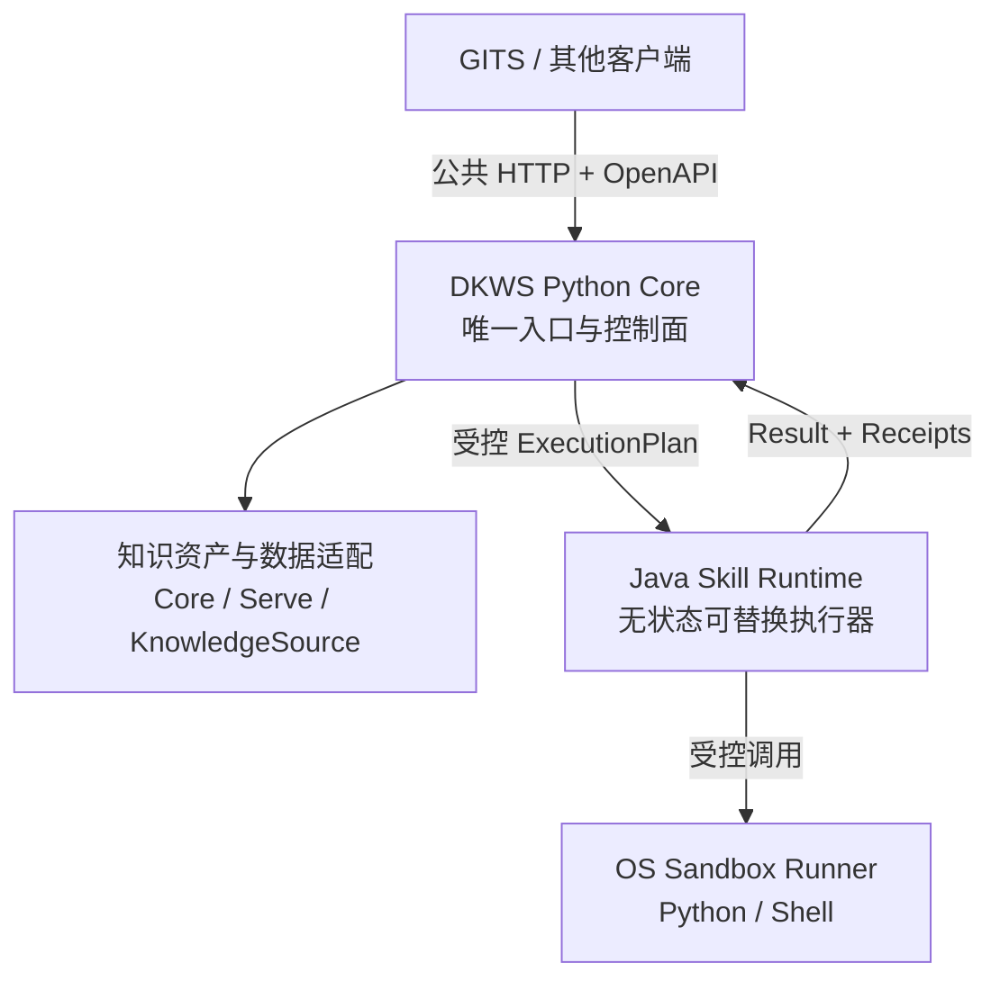

# DKWS 生产级混合架构独立评审报告

| 控制项 | 内容 |
|---|---|
| 文档编号 | `DKWS-ARCH-REVIEW-2026-08-26-002` |
| 文档版本 | `V1.0` |
| 评审日期 | `2026-08-26` |
| 评审角色 | Independent Enterprise Architecture Reviewer / Architecture QA Gate |
| 评审对象 | DKWS 方案 A（全量 Java）、方案 B（全量 Python）、方案 C（Python Core + Spring AI Alibaba Skill Runtime） |
| 目标决策 | 是否批准方案 C 进入 DKWS 正式架构基线与后续生产演进 |
| 证据纪律 | 仅依据评审包、其中的 POC 源码及指定文档；未提供或未复现的能力均标记“待补充/未验证” |

```text
GATE_DECISION=PASS_WITH_REQUIRED_CHANGES
OWNER_DECISION_RECOMMENDATION=MODIFY_THEN_APPROVE
TARGET_ARCHITECTURE=C_MODIFIED
CURRENT_DEPLOYABLE_BASELINE=PYTHON_CORE_ONLY
JAVA_SKILL_RUNTIME_ADMISSION=CONDITIONAL
GITS_INTEGRATION_PATH=HTTP_TO_DKWS_PUBLIC_API_ONLY
GITS_DIRECT_TO_JAVA_RUNTIME=REJECTED
SANDBOX_PRODUCTION_GATE=BLOCKED
IMPLEMENTATION_VERIFICATION=PARTIAL
PRODUCTION_READY=NO
GITS_UAT_PASS=NO
BASELINE_STATE=CANDIDATE
FROZEN=NO
```

> 本报告允许 Owner 批准“修改后的方案 C 作为目标架构方向，并开展下一轮准入验证”；不表示 Java Skill Runtime 已达到生产标准，也不表示 DKWS、GITS UAT 或生产发布门禁已经通过。

---

## 1. TL;DR 结论

### 1.1 核心判断

1. **方案 C 比方案 A 更合理。** DKWS 已有 Python 数据/知识核心，全量改写为 Java 缺少必要收益证据，且会引入大规模重写、回归和数据能力替换风险。当前材料不支持批准方案 A。
2. **方案 C 只有在修改后才可能优于方案 B。** 方案 B 仍是当前更简单、更可控的实施基线；方案 C 的长期优势取决于 Java Skill Runtime 能否通过内部契约、沙箱、版本治理、可靠性和运维准入。如果准入失败，DKWS 应继续按方案 B 演进，而不是阻塞生产加固。
3. **当前方案 C 的边界尚不清晰。** 材料同时允许 Java Runtime 作为 DKWS 内部组件、独立服务，甚至部署到 GITS 侧并由 GITS 直连。这会造成外部入口、Skill 权威、审计、幂等、身份和故障责任分裂，必须在基线前消除。
4. **推荐采用 C′（修改后的混合架构）：** Python Core 是 DKWS 唯一外部入口和控制面；Java Runtime 是 DKWS 产品内部、无权威状态、可替换的受控执行器；GITS 只通过 DKWS 公共 HTTP/OpenAPI 调用，不得直连 Java Runtime。
5. **Spring AI Alibaba 可作为 Java 执行器技术基座，但当前 POC 只证明了有限主链。** `read_skill` 与 `groupedTools` 有正向证据；PythonTool、ShellTool 未通过，工具调用回执、生产热更新、原子回滚、鉴权、持久化、审计、性能和故障恢复均未闭合。
6. **Python/Shell 沙箱失败不阻断方案 C 的方向选择，但阻断生产启用可执行工具。** 在沙箱准入通过前，PythonTool/ShellTool 必须生产默认关闭。不能仅凭“框架支持”或“可能是环境配置问题”将其标记为已解决。
7. **双语言、双运行时的复杂度可以接受，但前提是一个产品、一个发布列车、一条可观测链和一个故障责任面。** 当前材料尚未给出部署包、资源预算、版本矩阵、升级顺序、统一日志/Trace、双 SBOM 和恢复测试，因此只能有条件接受。
8. **GITS A+B 不应等待 Java Runtime。** B（撤销 Mock/H2 伪成功、fail-closed）先落地，A（恢复 GITS→DKWS 真实 HTTP）紧接执行；首轮真实 E2E 直接对接 Python Core。Java Runtime 是后续内部实现变化，不应改变 GITS 公共契约。
9. **“企业级稳定性、成熟项目引用、高性能、国产化”目前只得到方向性支持，没有形成充分证据。** 阿里开源、Java/Spring 生态成熟并不自动等于该特定版本组合已满足银行生产、性能或国产化要求。

### 1.2 对八个核心问题的直接回答

| 核心问题 | 独立结论 |
|---|---|
| 方案 C 是否优于 A、B | 明显优于 A；相对 B 仅在完成准入条件后更优。当前可实施基线仍是 B/Python Core |
| Python Core 与 Java Runtime 边界 | 当前不够清晰；按本报告 C′ 边界修改后可成立 |
| 双运行时复杂度是否可接受 | 有条件接受；必须统一产品化、交付、监控、安全和版本治理 |
| Spring AI Alibaba 是否足够生产 | 不足；可作为基座，不是完整生产运行态 |
| 沙箱失败是否阻断方案 C | 不阻断方向选择；阻断 Python/Shell 工具生产启用和 Java Runtime 正式准入 |
| GITS 联动是否顺畅 | 只在 GITS→DKWS Python Core 单一 HTTP 路径下顺畅；直连 Java Runtime 不批准 |
| 是否满足稳定性/成熟引用/性能/国产化 | 方向可能满足，材料不足以证明，均需补证 |
| 最终决策 | `修改后批准`，批准 C′ 目标方向与准入验证，不批准当前方案直接基线化或生产化 |

---

## 2. 评审包可受理性与证据状态

### 2.1 已审阅的核心材料

1. `docs/architecture/DKWS_SPRING_AI_ALIBABA_VS_PYTHON_NATIVE_COMPARISON_V1.0.md`；
2. `docs/architecture/DKWS_ADAPTER_FIRST_TECH_STACK_V1.1.md`；
3. `docs/architecture/DKWS_SPRING_AI_ALIBABA_SKILL_RUNTIME_POC_V1.0.md`；
4. `poc/spring-ai-alibaba-skill-runtime/POC_RESULT.md`；
5. `docs/dd/DKWS_independent_architecture_review_2026-08-26_V1.0.md`；
6. `docs/architecture/DKWS_PRODUCTION_EVOLUTION_PLAN_V2_CANDIDATE.md`；
7. `docs/integration/GITS_DKWS_A_PLUS_B_HANDOFF.md`；
8. 补充审阅 Phase 0 状态、Blocker、追溯、独立服务边界、Runtime Control Plane、NFR、OpenAPI、验收计划和 POC Java 源码。

评审包 SHA-256：

```text
7ff1e57322c653386361e4b456ca64d6ce4178ae25c6b5044b328738fb8976bf
```

单独提供的核心对比文档与压缩包内同名文件 SHA-256 一致：

```text
022acbe822af018cf65ed01fb9277b1550854f95d401fde67d93932cdb3cdb6d
```

### 2.2 可确认、部分确认与缺失

| 对象 | 状态 | 依据与限制 |
|---|---|---|
| Python Core 已有数据/知识层 | `CURRENT_DOCUMENTED / PARTIAL_VERIFICATION` | Phase 0 状态与既有独立评审明确；本包未包含完整 DKWS Python 源码和受控 commit |
| Spring AI Alibaba POC 源码 | `CURRENT_PRESENT` | Java 源码与编译后的 class 文件在包内 |
| 服务启动、Skill 扫描、列表 | `DOCUMENTED_PASS` | `POC_RESULT.md` 记载 PASS；缺完整原始日志和自动化测试 |
| `read_skill` | `DOCUMENTED_PASS` | POC 结果记载模型调用；缺结构化调用回执和可重放测试 |
| `groupedTools` | `DOCUMENTED_PASS` | 有 Interceptor 日志摘录；源码只对 `demo-skill` 硬编码两项工具 |
| PythonTool/ShellTool | `DOCUMENTED_FAIL` | POC 明确失败 |
| Java Runtime 与 Python Core 集成 | `MISSING` | 没有内部 API、鉴权、幂等、故障和 Trace 契约，也没有 E2E |
| Java Runtime 与 GITS 集成 | `MISSING` | POC 未接 GITS；GITS UAT 仍为 NO |
| 生产热更新、原子切换和回滚 | `DESIGNED_NOT_IMPLEMENTED` | POC 使用 `autoReload`，生产版本化 activate 尚未实现 |
| 生产沙箱 | `MISSING / FAILED_POC` | GraalVM/Shell 均未通过，nsjail 只是候选建议 |
| 性能、稳定性、国产化 | `PENDING_EVIDENCE` | 无基准、稳定性运行、兼容矩阵或国产化认证清单 |

### 2.3 材料矛盾

1. POC `README.md` 仍称“骨架候选，待按官方 API 补齐”，并把 `groupedTools`、PythonTool/ShellTool、Skill Registry 列为 TODO；源码和 `POC_RESULT.md` 又声称其中部分已完成。必须统一版本和状态。
2. `HANDOVER.md` 同时称 POC 为“工程骨架，待补齐”，核心对比文档则把主要链路列为已验证。
3. `DKWS_PHASE0_EVIDENCE_MANIFEST.json` 把若干测试标记为 `verified=true`，状态基线却称原始报告 `DOCUMENTED_BUT_NOT_VERIFIED`；提供的测试日志只有点号进度，没有命令、环境、用例名和退出码上下文。
4. 生产演进计划 V2 没有纳入 Java Runtime；核心对比文档又新增一套 Phase 0-5 顺序，且将 GITS A+B 推迟到 Phase 4，与既有独立评审“尽早 A+B”的路线冲突。
5. 独立服务边界文档仍把 `dkws-server` 定义为 HTTP API、Skill 执行和知识服务的单一组件；方案 C 新增 Java Runtime 后，组件模型、部署包和责任边界尚未更新。

因此本轮可以完成架构方向评审，但不能完成生产实现验收：

```text
SUBSTANTIVE_DESIGN_REVIEW=COMPLETE
IMPLEMENTATION_VERIFICATION=PARTIAL
PRODUCTION_ADMISSION_REVIEW=NOT_PASSED
```

---

## 3. 总体结论：修改后批准

### 3.1 三方案独立评价

| 方案 | 战略适配 | 当前可实施性 | 主要收益 | 主要代价 | 决策 |
|---|---|---|---|---|---|
| A：全量 Java/Spring | 低 | 低 | 与 GITS 同栈；Java 运维生态成熟 | 重写 Python 数据/知识核心；回归与迁移风险高；缺收益证明 | **拒绝作为当前路线** |
| B：全量 Python | 高 | 高 | 保留现有资产；单语言单运行时；数据生态和运维边界简单 | Skill/Tool 运行态需持续自研和加固 | **保留为当前实施基线和回退路线** |
| C：原始混合方案 | 中高 | 中低 | 保留 Python，同时复用 Java Skill 能力 | 产品边界、入口、权威、沙箱和运维未闭合 | **当前版本不直接批准** |
| C′：受控混合方案 | 高 | 中 | Python 保持产品控制面；Java 仅做内部可替换执行器 | 仍需双栈治理和准入 POC | **修改后批准为目标架构候选** |

### 3.2 为什么不是直接批准方案 C

当前 POC 证明的是“框架具有 Skills Hook 和动态工具披露能力”，不是“DKWS 已得到生产级 Skill Runtime”。以下责任仍由 DKWS 自己建设：

- Skill 包签名、版本、审核、激活、回滚和撤销；
- 调用鉴权、租户/客户范围和 Policy Decision；
- 持久 Job、幂等、超时、重试、取消和 dead-letter；
- Tool 风险分级、沙箱、出站网络、Secret 和副作用回执；
- Prompt/模型策略、预算、评测和 Guardrails；
- 统一审计、Metrics、Tracing、告警和恢复；
- Python Core—Java Runtime 内部契约和兼容矩阵。

因此，“使用成熟框架”只能减少一部分 Agent/Skill 编排代码，不能消除平台工程责任。

---

## 4. 推荐的方案 C′ 架构



### 4.1 强制边界

| 能力 | Python Core | Java Skill Runtime | Sandbox Runner | GITS |
|---|---|---|---|---|
| 公共 API/OpenAPI | **权威** | 不对外 | 不对外 | 消费 |
| 客户/租户身份、认证、授权 | **权威** | 只验证 Core 服务身份和执行票据 | 只接受 Runtime 受控任务 | 提供受认证调用身份 |
| 幂等、Job、Gate、审计 | **权威并唯一写 Runtime Store** | 不直接写 SQLite；返回回执 | 返回进程级回执 | 不得伪造 DKWS 结果 |
| 五层知识资产、数据源、证据 | **权威** | 只通过受控 Context/Source API 读取 | 不直接访问 Core | 不直读文件 |
| Skill 包审核、版本、激活和撤销 | **权威控制记录** | 只加载已激活的 ID/version/hash | 只执行指定版本 | 不管理 DKWS Skill |
| `read_skill`、`groupedTools`、Agent 编排 | 发出策略和 ExecutionPlan | **执行职责** | 无 | 无 |
| Prompt/模型/预算策略 | **权威 Registry/Policy** | 按批准的策略执行模型调用并回传用量 | 无 | 无 |
| Python/Shell 执行 | 不在进程内直接执行 | 调度，不作为最终隔离边界 | **唯一执行边界** | 无 |
| 工具回执/模型回执 | 持久化和审计 | 生成结构化回执 | 提供资源/退出/输出证据 | 只消费公共结果 |

### 4.2 明确禁止的形态

1. GITS 直连 Java Skill Runtime；
2. Java Runtime 形成第二套对外 Skill API；
3. Python 与 Java 同时拥有可写 Skill Registry；
4. Python、Java 同时直接写同一 SQLite Runtime Store；
5. Java Runtime 绕过 Python Core 自行决定客户权限、Gate、Prompt、模型或预算；
6. 生产中用 `autoReload(true)` 直接扫描可写目录并即时生效；
7. 在未通过沙箱安全门禁前启用通用 Python/Shell Tool；
8. 把 Java Runtime 部署到 GITS 进程内并继续称其为 DKWS 独立服务能力。

### 4.3 内部通信建议

首期建议使用**私有 HTTP/JSON 契约**，部署在 loopback、容器内部网络或 Unix Domain Socket 后面，并使用服务身份认证；暂不同时引入 HTTP 和 gRPC。只有性能基准证明 HTTP 成为瓶颈时再评估 gRPC。

内部契约至少包含：

- `ExecutionPlan`：tenant/customer scope、skillId、skillVersion、skillHash、activationPlanHash、policyId、prompt/model policy ref、deadline、idempotencyKey、allowedToolIds、source refs；
- `ExecutionResult`：稳定状态、结构化输出、degraded/partial、错误码、retryable、开始/结束时间；
- `ToolCallReceipt`：tool/version、输入 hash、策略决策、沙箱配置 hash、退出码、资源用量、输出 hash、副作用 receipt；
- `ModelCallReceipt`：provider/model、prompt hash、参数 hash、Token、成本、延迟、降级原因；
- `TraceContext`：W3C trace context + DKWS requestId；
- 兼容版本、超时、取消、重试、熔断和重复请求语义。

---

## 5. 逐维度评审明细

### 5.1 架构合理性

**结论：当前部分通过；按 C′ 修改后通过方向评审。**

Python Core 保留知识权威、数据适配和公共 API 是合理的；Java Runtime 专注 `read_skill`、`groupedTools` 和执行期编排也具备合理性。当前最大问题不是双语言本身，而是**权威分裂**：材料把 Skill 仓库、热加载、ToolCall、沙箱都交给 Java，同时 Python Core 又承担审计、Runtime Store、公共 API 和现有 Skill 执行，容易形成两套执行语义。

必须把 Java Runtime降格为“可替换内部执行器”，而不是第二个 DKWS 控制面。所有外部请求必须由 Python Core 建立身份、幂等、Job、Policy 和 ExecutionPlan 后再调 Java。

### 5.2 Skill 运行态

**结论：框架能力候选成立，生产能力不成立。**

正向证据：

- `FileSystemSkillRegistry` 能扫描 demo Skill；
- `SkillsAgentHook.autoReload(true)` 产生 reload 日志；
- POC 记载 `read_skill` 可用；
- Interceptor 日志显示 `groupedTools` 向一次执行动态加入两个工具。

关键不足：

1. `groupedTools` 在源码中只对 `demo-skill` 硬编码，不是通用 Skill→Tool 策略注册；
2. `SkillExecutionService` 明确没有解析真实 `toolCalls`，只返回空数组和 `agent.call`；
3. `sessionId` 未体现持久会话、并发隔离或生命周期；
4. 上传返回的版本固定为 `1.0.0`，列表同样固定版本且 tools 为空；
5. 上传时先删除现有 Skill 再移动新目录，不是原子激活，失败时可能失去旧版本；
6. 未证明修改 SKILL.md 后读取到新内容，只证明触发 reload 日志；
7. 没有 Skill 签名、hash、审批、兼容性、撤销、回滚和并发激活测试；
8. 没有自动化测试目录、覆盖率、长稳、故障注入和并发结果；
9. API 无认证，错误可能以普通 200 响应返回；
10. POC 文档写 `ShellTool2`，源码实际使用 `ShellTool`，版本/API 边界需统一。

生产不得使用目录 watcher 式即时热改。应采用“上传隔离区→静态检查/签名/测试→版本化安装→显式 activate→原子指针切换→可回滚”。

### 5.3 Python/Shell 沙箱

**结论：生产阻断。**

POC 明确记录 PythonTool 和 ShellTool 均失败。当前不能认定“只是环境配置问题”：这只是一个待验证假设。即使 GraalVM 配置成功，也仍需证明第三方库兼容、文件/网络/进程隔离、资源限制、逃逸防护和稳定性。

源码还显示：

- `ShellCommandGuard` 虽被声明为 Bean，但没有接入 `ShellTool`；
- `work-dir`、`allow-network`、Python timeout、max-output 等配置没有形成完整的可验证执行链；
- 当前 Guard 即使接入，也只检查第一个 token，不足以独立防止复合命令、重定向、管道和参数级危险行为；
- Zip 解压限制了压缩包大小和文件数，但没有看到解压后总字节限制、签名、内容扫描和原子安装。

建议生产基线：

- 通用 Python/Shell 使用独立 `nsjail` OS 级 Runner；
- GraalVM PythonTool 只作为可选的、无 I/O、无第三方原生依赖的受限表达式执行器；
- Shell 默认关闭，按工具 ID 使用固定 executable/argv Schema，不接受自由命令字符串；
- Runner 启用只读根、临时工作目录、无网络默认、seccomp/cgroup/uid namespace、CPU/内存/进程/文件/输出/时间限制；
- 每次执行产生 sandbox profile hash 和 ToolCallReceipt。

### 5.4 数据与知识层

**结论：保留 Python Core，禁止在 Java 重复建设。**

PyArrow、DuckDB、Kùzu、Pydantic/FastAPI 以及 `KnowledgeSource` typed capability 与现有 DKWS 方向一致。材料没有显示把这些能力重写成 Java 能取得可验证收益。图、Parquet、RAG、受控 HTTP/JDBC 等适配器应继续放在 Python Core；Java Runtime 通过受控 Source API 或执行上下文获取必要信息，不直接连接客户数据源。

这也意味着 Java Runtime 不应拥有第二套 Source 凭据、SQL 模板、数据脱敏和证据来源逻辑。

### 5.5 GITS 联动

**结论：公共路径必须是 GITS→DKWS Python Core HTTP。**

GITS 与 Java Runtime 同为 Java 并不足以支持“直连”。直连会：

- 绕过 DKWS 的公共 OpenAPI 和合同 hash；
- 绕过 Python Core 的幂等、Job、Gate、审计、成本和证据装配；
- 形成两套超时、错误和 fail-closed 语义；
- 使 DKWS-owned 能力再次嵌入 GITS，破坏独立服务边界；
- 让 A+B UAT 无法证明实际经过完整 DKWS 控制面。

GITS A+B 的正确顺序不变：

1. B：先删除/禁用 Mock、H2、fallback 伪成功，DKWS 不可用时明确空态；
2. A：恢复 GITS→DKWS 公共 HTTP Adapter；
3. 对 Python Core 完成 R1、供应链、assemblyTrace、SP-20、SP-21、Gate 真实 E2E；
4. Java Runtime 后续接入属于 DKWS 内部实现演进，GITS 契约和调用地址保持不变；
5. Java Runtime 故障时，Python Core按 Skill 能力返回明确失败/降级，不允许 GITS 改走旁路。

### 5.6 生产级能力与双运行时运维

**结论：复杂度可接受，但当前设计尚未证明可控。**

可接受的必要条件：

- 一个 DKWS 安装包/Compose 项目，而不是两套独立产品；
- 一个发布 manifest，同时记录 Python、Java、Skill、契约和镜像 hash；
- 两套构建流水线但一个发布 Gate；
- 两份 SBOM/依赖扫描汇总到一个发行审计包；
- 统一 W3C Trace、requestId、日志字段和 Metrics 命名；
- Java Runtime 尽量无状态，备份只覆盖 Python Runtime Store、知识资产和受控 Skill 包；
- 明确启动顺序、readiness 依赖、降级矩阵、升级顺序和回滚兼容矩阵；
- JVM heap、Python worker、Sandbox 并发和单机总资源预算；
- Java Runtime 不可用时，非 Java Runtime 依赖的知识只读能力仍可用，相关 Skill 明确 fail-closed。

当前材料没有这些机器证据，因此“双运行时可接受”只能是架构判断，不能视为生产验收。

### 5.7 安全边界

**结论：当前不通过。**

外部安全由 Python Core 统一负责；Python→Java 内部调用仍需服务身份、短期执行票据或等价认证、重放防护和最小权限。Java Runtime 不持有客户级长期凭据；Sandbox Secret 按调用临时注入且不得进入环境快照、日志或 Skill 包。

生产前需要对 Skill zip、Java 依赖、GraalVM/CPython、系统命令、容器镜像分别形成供应链和威胁模型。POC 中的无鉴权管理上传接口不能进入任何共享环境。

### 5.8 企业级稳定性、成熟引用、高性能和国产化

**结论：均未充分证明。**

| 目标 | 当前材料能证明的内容 | 仍缺失 |
|---|---|---|
| 企业级稳定性 | Java/Spring 与 Python 生态方向成熟 | 特定版本长稳、故障恢复、升级兼容、并发和资源基准 |
| 成熟项目引用 | 文档声称有阿里生态和社区示例 | 可核验生产案例、版本支持周期、维护策略、兼容矩阵 |
| 高性能 | 文档提出“Python 数据 + Java 编排” | 端到端延迟、吞吐、JVM 内存、跨进程开销、沙箱启动成本 |
| 国产化 | Spring AI Alibaba 为国内开源项目，Python 可选国产组件 | 国产 CPU/OS/JDK/密码模块/中间件/LLM 适配实测与认证清单 |

“开源主体来自国内”不等同于完成国产化适配；“Java 高并发”也不能替代本项目实测。

### 5.9 风险与演进

**最大风险不是双语言，而是控制面分裂。** 一旦 GITS、Python Core、Java Runtime 都能选择 Skill、调用工具或保存状态，系统会出现相同 requestId 不同结果、审计断链、策略绕过和版本不可重放。

第二风险是把 Agent Framework 的演示能力误当作安全执行平台。第三风险是 Spring AI Alibaba、Spring AI、Spring Boot、JDK/GraalVM 多版本联动升级带来的兼容性和供应链责任。

方案 B 是有效替代路线：如果团队无法维护双栈，或 Java Runtime 准入 POC 未通过，继续用 Python Core + OS Sandbox + 受控 Tool ABI 不会破坏 DKWS 总体架构。

---

## 6. Blocker（阻断项）

以下 Blocker 不足以否定方案 C 的方向，但会阻止当前方案进入正式架构基线或生产：

| ID | 阻断项 | 影响/严重度 | 必须动作 | 关闭证据 |
|---|---|---|---|---|
| `C-B01` | Java Runtime 部署形态、产品所有权和权威边界未决，且材料允许 GITS 直连 | 严重：控制面与审计分裂 | 采用 C′；形成混合架构 ADR，明确唯一外部入口并删除 GITS 直连选项 | Owner 批准 ADR、边界矩阵、部署拓扑 |
| `C-B02` | Python Core—Java Runtime 无机器内部契约 | 严重：无法保证身份、幂等、版本、错误、Trace 和重放 | 建 OpenAPI/JSON Schema 或等价内部合同，含 ExecutionPlan/Result/Receipts | 契约 hash、双端 contract tests、兼容矩阵 |
| `C-B03` | PythonTool/ShellTool 沙箱执行失败，且源码安全配置未闭合 | 严重：代码执行、数据泄露、主机逃逸和资源耗尽 | 生产默认关闭；完成 nsjail Runner 和恶意用例/资源/逃逸测试 | 独立安全 QA、失败注入、审计回执 |
| `C-B04` | POC 未完成 DKWS 集成、真实 Tool receipt、生产热更新/回滚和故障恢复 | 严重：框架能力无法转化为产品能力 | 执行 POC-2 准入矩阵 | 原始日志、自动化测试、受控 commit、E2E |
| `C-B05` | 方案 C 尚未纳入独立服务边界、生产演进 V2、NFR、验收计划和 ADR | 严重：架构文档互相冲突，无法授权施工 | 统一 Phase 0 基线和 supersession map | 冲突清零、追溯矩阵、Owner 决策 |

---

## 7. Major（高优先级问题）

| ID | 问题 | 影响/概率 | 建议动作 |
|---|---|---|---|
| `C-M01` | POC README、HANDOVER、源码和 POC_RESULT 状态不一致 | 高/高：误判完成度 | 生成受控 POC 状态文件，旧 README 标记 superseded |
| `C-M02` | `groupedTools` 只绑定 demo-skill，未形成动态 Tool Policy | 高/高 | 从 Core 下发 ActivationPlan，按 skill/version/policy 构建工具集合 |
| `C-M03` | Skill 上传先删旧目录、版本硬编码、无原子激活和回滚 | 高/高 | staging+校验+签名+版本目录+原子 CURRENT+回滚 |
| `C-M04` | toolCalls/trace 在响应中未真正解析和持久化 | 高/高 | 产出结构化 Tool/Model Receipts，由 Core 入审计库 |
| `C-M05` | Python 与 Java 都存在 LLM/Agent 能力，职责可能重复 | 中/高 | Core 拥有 Prompt/Model/预算策略；Java 只按 ExecutionPlan 执行并回传用量 |
| `C-M06` | 双运行时无统一发布、监控、日志、升级、回滚和资源预算 | 高/高 | 建单一发行 manifest、统一 OTel、依赖矩阵、故障/回滚演练 |
| `C-M07` | 对“成熟项目引用、性能、国产化”的结论缺少证据 | 高/中 | 补官方支持/许可/案例、国产化矩阵和本项目性能实测 |
| `C-M08` | 核心对比文档的 Phase 编号与生产演进 V2 冲突，且把 GITS A+B 推迟 | 高/高 | 以 V2 为主线；A+B 前移，Java Runtime 设独立准入 Gate |
| `C-M09` | Java 依赖版本组合、锁定、SBOM、漏洞/许可证和支持周期缺失 | 中/高 | 依赖锁/BOM 归档、SBOM、扫描、升级策略和版本兼容测试 |
| `C-M10` | 无 Java Runtime 故障降级矩阵 | 中/高 | 按 Skill 声明 REQUIRED/OPTIONAL runtime；不可用时显式 fail-closed/degraded |
| `C-M11` | POC 无自动化测试、原始运行日志和受控 commit | 高/高 | 补 source manifest、commit、测试报告、环境清单、重放脚本 |
| `C-M12` | Phase 0 证据清单自身存在 verified 状态矛盾 | 中/高 | 统一 `VERIFIED/DOCUMENTED/PENDING` 口径并由独立 QA 复核 |

---

## 8. Minor（改进建议）

1. 核心对比文档关联链接第 10 行应指向 `POC_RESULT.md`，不应再次指向 POC 设计文档。
2. 统一 `ShellTool`、`ShellTool2` 的正式类名、版本和能力边界。
3. 将 POC API 路径放入明确的内部 namespace，例如 `/internal/v1/runtime/*`，禁止与 DKWS 公共 API 混用。
4. `SkillInfo` 应返回真实 version、hash、status、activatedAt、tool IDs 和 policy ID，不得硬编码。
5. 健康检查区分 liveness、readiness、Skill registry、模型、Sandbox Runner 和 Core contract compatibility。
6. `autoReload` 仅保留开发 profile；生产配置若启用应拒绝启动。
7. 对 Java Runtime 规定最大请求、最大 ContextPackage、最大工具输出和高基数标签限制。
8. OpenAPI 中 `x-contract-bundle-hash: PENDING_COMPUTE` 与已生成 manifest hash 的关系需要明确，避免两个事实源。
9. 清理交接材料中残留的外部开发运行环境产品依赖与命名，保持 DKWS 独立服务边界。

---

## 9. 对方案 C 的最终建议

### 9.1 推荐路线

采用“**B 作为当前实施基线，C′ 作为经准入的目标架构**”：

```text
Phase 0A：批准 C′ 边界与混合架构 ADR
  ↓
Phase 1：Python Core 生产加固 + GITS B→A 真实 HTTP UAT
  ↓
Gate C-RUNTIME-01：Java Runtime POC-2 准入
  ↓ PASS
Phase 2：以 DKWS 内部无状态执行器方式接入 Java Runtime
  ↓
Gate C-SANDBOX-02：OS Sandbox 安全与可靠性准入
  ↓ PASS
受控启用 Python/Shell Tool
```

### 9.2 POC-2 最低准入标准

1. 至少两个不同 Skill 动态注册，工具集合不能硬编码；
2. `read_skill→groupedTools→真实 ToolCall→结构化 receipt` 可重放；
3. Skill 包版本/hash/签名校验、显式 activate、原子切换和回滚通过；
4. Python Core→Java Runtime 的鉴权、幂等、deadline、取消、Trace、错误合同通过；
5. Java Runtime 不直接写 SQLite，不直接访问 Core 文件目录；
6. Java Runtime 重启、超时、模型失败、重复请求和网络中断故障注入通过；
7. nsjail 下 Python/Shell 受控执行通过，路径穿越、网络、fork bomb、内存/CPU、超时、输出超限、命令注入均被阻断；
8. 自动化单元、契约、集成、安全和恢复测试有原始报告；
9. 生成 SBOM、依赖/许可证/漏洞报告；
10. 单机资源和延迟基准符合 Owner 批准的 NFR；
11. Compose/systemd 独立安装，不依赖外部智能体运行平台；
12. 独立 QA 在受控 commit 上复跑签署。

任何一项未通过时，Java Runtime 保持实验组件，DKWS 继续按 Python-only 路线运行。

---

## 10. 如果选择其他方案

### 10.1 方案 A

不建议选择。只有在 Owner 明确决定 DKWS 全产品统一 Java、接受 Python 数据/知识层重写，并提供迁移成本、性能收益、功能等价和回滚证据后，才应重新评估。当前材料没有这些前提。

### 10.2 方案 B

方案 B 是可靠的正式备选，不是“低一等”方案。以下任一条件成立时，应选择或继续保留 B：

- 团队无法长期承担 Java+Python 双栈；
- Java Runtime POC-2 或 Sandbox Gate 未通过；
- 单机资源预算无法容纳 JVM+Python+Sandbox；
- Java Runtime 没有带来可测的交付周期、稳定性或性能收益；
- 组织更重视单体可运维性，而不是复用 Java Agent 框架。

方案 B 仍需自研受控 Skill/Tool ABI 和版本治理，但它能保持单一运行时、单一故障面和较低运维成本。

---

## 11. 给 Owner 的决策建议

### 11.1 建议批准

1. 批准 C′ 作为**目标架构候选**：Python Core 唯一外部入口和控制面，Java Runtime 仅为内部可替换执行器；
2. 批准 Phase 1 继续以 Python Core 为生产加固主体，不等待 Java Runtime；
3. 批准 GITS A+B 立即按公共 HTTP/OpenAPI 落地；
4. 批准开展 POC-2 与 Sandbox Gate；
5. 批准方案 B 作为正式回退路线；
6. 批准 Java Runtime 尽量无状态、不得直接写 Runtime Store 或成为 Skill 权威源；
7. 批准 OS 级 Sandbox 为通用 Python/Shell 的默认目标，GraalVM 仅作受限可选执行器。

### 11.2 不建议批准

- 不批准全量 Java 重写；
- 不批准 GITS 直连或内嵌 DKWS Java Skill Runtime；
- 不批准当前 POC 直接进入生产；
- 不批准生产 `autoReload` 扫描可写目录；
- 不批准未通过安全 Gate 的 PythonTool/ShellTool；
- 不批准把 POC 部分 PASS 宣称为 Spring AI Alibaba 已满足完整生产要求；
- 不批准把“阿里开源”直接等同于国产化合规完成；
- 不批准把 GITS A+B 推迟到 Java Runtime 和 Sandbox 之后；
- 不批准在没有性能基准时宣称混合架构高性能。

### 11.3 Owner 建议决策块

```text
OWNER_DECISION=APPROVE_WITH_CONDITIONS
TARGET_ARCHITECTURE=C_MODIFIED
PHASE1_IMPLEMENTATION=PYTHON_CORE_ONLY
JAVA_RUNTIME=CONDITIONAL_INTERNAL_EXECUTOR
JAVA_RUNTIME_DEPLOYMENT=DKWS_OWNED_SEPARATE_PROCESS
PUBLIC_API_OWNER=DKWS_PYTHON_CORE
RUNTIME_STATE_OWNER=DKWS_PYTHON_CORE
GITS_DIRECT_JAVA_RUNTIME=NO
GITS_NEXT_OPTION=A+B
SANDBOX_DEFAULT=OS_LEVEL_NSJAIL
GRAALVM_PYTHON=LIMITED_OPTIONAL
PYTHON_SHELL_TOOLS_PRODUCTION=DISABLED_UNTIL_GATE_PASS
FALLBACK_ARCHITECTURE=PYTHON_NATIVE
PRODUCTION_READY=NO
GITS_UAT_PASS=NO
NEXT_GATE=C_RUNTIME_POC2_AND_INTERNAL_CONTRACT_GATE
```

---

## 12. 待补充材料清单

| ID | 待补充材料 | 用途 | 建议责任方 |
|---|---|---|---|
| `C-ME01` | DKWS Python Core 受控源码 commit、manifest | 验证现有能力和真实边界 | DKWS Tech Lead |
| `C-ME02` | POC 受控 commit、完整原始日志、启动命令、环境清单 | 独立复现 POC | Java Runtime Lead |
| `C-ME03` | POC 自动化单元/契约/集成测试及覆盖率 | 验证 PASS 声称 | QA |
| `C-ME04` | Python Core—Java Runtime 内部 OpenAPI/Schema | 关闭 `C-B02` | Contract Owners |
| `C-ME05` | 混合架构 ADR、组件所有权和部署拓扑 | 关闭 `C-B01/C-B05` | Architecture Owner |
| `C-ME06` | Skill 包格式、签名、版本、激活、回滚和撤销合同 | 生产热更新准入 | Skill Runtime Lead |
| `C-ME07` | nsjail/bubblewrap POC、威胁模型、逃逸/资源/命令注入测试 | 关闭 `C-B03` | Security Lead |
| `C-ME08` | Java/Python 双栈 SBOM、许可证、漏洞和支持周期 | 供应链准入 | Build/Security |
| `C-ME09` | Spring AI Alibaba/Spring AI/Spring Boot/JDK/GraalVM 兼容矩阵 | 升级稳定性 | Java Platform Lead |
| `C-ME10` | 单机 CPU、内存、启动时间、P95/P99、吞吐和沙箱开销基准 | 性能和容量决策 | Performance QA |
| `C-ME11` | 国产 OS/CPU/JDK/密码套件/依赖/LLM 兼容实测矩阵 | 国产化判断 | Infrastructure/Security |
| `C-ME12` | 统一日志、Metrics、Trace、告警与运行手册 | 双运行时运维准入 | SRE |
| `C-ME13` | 备份、恢复、升级、回滚、Java Runtime 故障注入证据 | 可靠性准入 | Reliability QA |
| `C-ME14` | GITS→DKWS 最终 HEAD HTTP trace、合同 hash、A+B UAT 原始报告 | 确认联动 | GITS/DKWS/UAT Owner |
| `C-ME15` | 可核验的生产案例、维护策略和支持承诺 | “成熟项目引用”判断 | Architecture/Procurement |

---

## 13. 最终结论

方案 C 的价值成立：它避免重写 DKWS 已有 Python 数据/知识层，同时利用 Spring AI Alibaba 的 Skill Hook 和工具渐进披露能力。但当前方案把“框架能力可用”推导为“生产 Skill Runtime 成熟”，证据跨度过大；部署形态、控制面、内部契约、沙箱和 GITS 路径也尚未收敛。

因此本次不是简单批准原方案 C，而是：

```text
ARCHITECTURE_DIRECTION=C_MODIFIED_CONDITIONALLY_ACCEPTED
ORIGINAL_C_BASELINE_APPROVAL=DENIED_UNTIL_REMEDIATED
SPRING_AI_ALIBABA=FRAMEWORK_CANDIDATE_NOT_PRODUCTION_RUNTIME
PYTHON_CORE=RETAIN_AS_AUTHORITY_AND_PUBLIC_CONTROL_PLANE
GITS=HTTP_CLIENT_OF_DKWS_ONLY
SANDBOX=PRODUCTION_BLOCKED
OWNER_DECISION=MODIFY_THEN_APPROVE
```

这是一个可以继续验证、值得保留，但必须先把“两个技术栈”治理成“一个产品”的方案。
