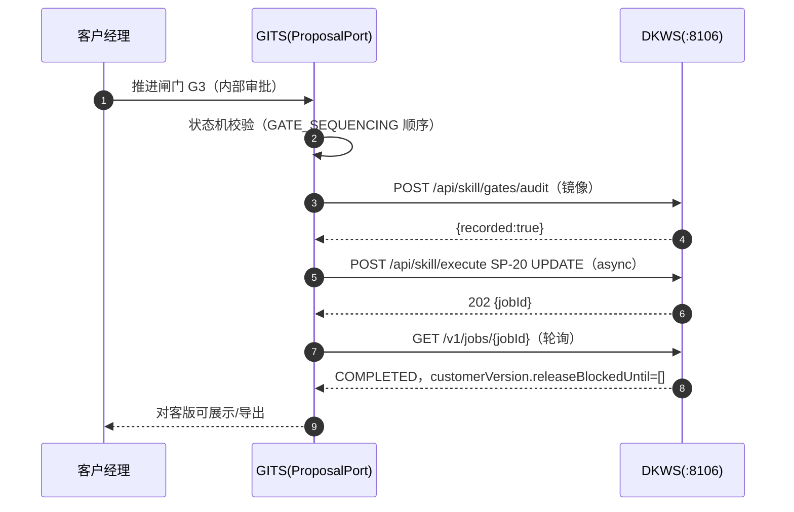
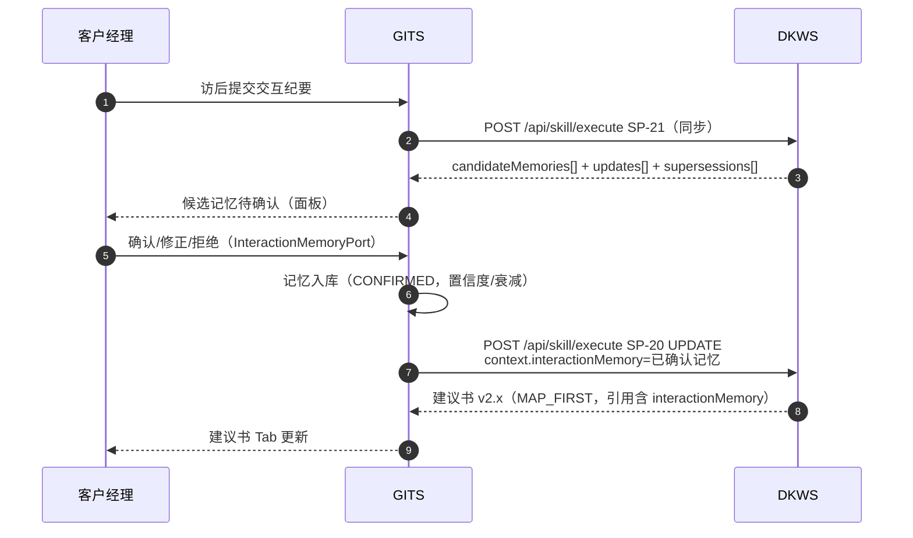

# DKWS v1.4 × GITS 对接样例包（SP-20 / SP-21 / 闸门 / 记忆）

> 日期：2026-08-23 ｜ 契约：`docs/dd/skill-execute-api-contract.md` v1.3 + v1.4 扩展
> 全部样例取自 8106 真实运行（真实 DeepSeek），仅截断展示。
> GITS 侧只需实现 `ProposalPort`（SP-20）+ `InteractionMemoryPort`（SP-21 记忆持久化），
> 闸门推进与记忆生命周期权威在 GITS；DKWS 提供清单/审计镜像/就绪度建议。

---

## 1. 端点速查（v1.4）

| 方法 | 路径 | 用途 |
|---|---|---|
| POST | `/api/skill/execute` | 执行任意 Skill；`"async":true` → 202+jobId |
| GET | `/v1/jobs/{jobId}` | 异步轮询（完成时 `data.skill_result` 为完整执行响应） |
| GET | `/api/skill/report/{requestId}` | 可视化报告页（SP-20 建议书模板 / 供应链图谱模板 / JSON 兜底） |
| GET | `/api/skill/gates/{customerId}` | GATE-BIZ-* 闸门清单资产 |
| POST | `/api/skill/gates/audit` | 闸门决策**镜像**（非权威，权威在 GITS） |
| GET | `/api/skill/health` | 技能清单 |

---

## 2. SP-20 服务建议书（异步长任务）

### 2.1 请求

```json
{
  "skillId": "SP-20",
  "requestId": "sp20-samples-2",
  "async": true,
  "request": {
    "context": {
      "schemaVersion": "1.0.0",
      "customerId": "CUST-CORP-0001",
      "customerName": "华东精工装备集团有限公司",
      "industry": "制造业-装备制造",
      "engagementPhase": "FIRST_CONTACT",
      "journeyId": "J-1", "operatingCaseId": "OC-1", "roundNumber": 1,
      "enterpriseData": {
        "basicInfo": { "registeredCapital": "5亿", "establishedDate": "2005-03-15",
                       "legalRepresentative": "张伟", "businessScope": "精密加工、智能装备",
                       "registeredAddress": "浙江省杭州市" },
        "financialSummary": { "revenue": [{"year": "2023", "value": 850000000}],
                              "netProfit": [{"year": "2023", "value": 80000000}] },
        "creditFacility": { "totalApproved": 80000, "totalUsed": 60000 },
        "transactionSummary": { "monthlyAvgVolume": 12000 }
      },
      "publicData": { "industryReports": [], "newsEvents": [], "regulatoryChanges": [] },
      "interactionHistory": [], "interactionMemory": [],
      "evidence": [],
      "proposalContext": {
        "proposalType": "INITIAL",
        "gateState": { "passed": ["G0"], "current": "G1" }
      }
    }
  }
}
```

### 2.2 响应（异步，202）

```json
{ "jobId": "JOB-SKILL-20260823-002", "status": "PENDING" }
```

### 2.3 轮询 `GET /v1/jobs/{jobId}`（完成时）

```json
{
  "request_id": "REQ-JOB-JOB-SKILL-20260823-002",
  "status": "OK",
  "data": {
    "job_id": "JOB-SKILL-20260823-002",
    "job_type": "SKILL",
    "status": "COMPLETED",
    "skill_result": {
      "requestId": "sp20-samples-2",
      "status": "ok",
      "data": { "skillId": "SP-20", "reportUrl": "/api/skill/report/sp20-samples-2", "result": { /* 见 2.4 */ } },
      "errors": [],
      "assemblyTrace": [ { "phase": "resolve", "status": "ok", "message": "skillId=SP-20 requestId=sp20-samples-2" },
                         { "phase": "route", "status": "ok", "message": "路由模式 ONTOLOGY_THEN_MAP（proposalType=INITIAL, phase=FIRST_CONTACT）" },
                         { "phase": "assets", "status": "ok", "message": "装配资产：行业框架=MANUFACTURING，章节 8 个" },
                         { "phase": "model", "status": "ok", "message": "章节 CH01 生成完成（claims 6）" },
                         "…（CH02~CH08 同）…",
                         { "phase": "compose", "status": "ok", "message": "规则校验：违规 0 条（SUCCESS）" } ],
      "modelCalls": [ { "model": "deepseek-chat", "inputTokens": 4471, "outputTokens": 10138, "latencyMs": 38510 } ]
    }
  },
  "errors": [], "meta": { "service_version": "1.0.0", "data_version": "active" }
}
```

### 2.4 `data.result`（ServiceResult 摘要，真实值）

```json
{
  "schemaVersion": "1.0.0", "skillId": "SP-20",
  "runId": "RUN-PROPOSAL-20260823183250",
  "status": "SUCCESS",
  "timestamp": "2026-08-23T18:32:50Z",
  "content": {
    "proposalDraft": "# 华东精工装备集团有限公司综合金融服务建议书\n\n> 类型：INITIAL …（8 章 Markdown 正文，真实 11,710 字）",
    "internalVersion": {
      "content": "…（全文 + ## 内部判断 + ## 待审批事项）…",
      "factLabels": { "华东精工…": "F", "…存在综合金融服务需求…": "C", "…" : "…" }
    },
    "customerVersion": {
      "content": "…（仅 F/A 内容，段落级过滤）…",
      "filteringNotes": [ "移除段落（含非 F/A 断言：['C']）：…", "…共 15 条" ],
      "includes": ["F", "A"], "excludes": ["C", "B", "H", "P"],
      "releaseBlockedUntil": ["G1", "G2", "G3"]
    },
    "customerVersionNote": "对客版已生成（仅 F/A 内容），等待 G1/G2/G3 闸门通过后由 GITS 放行。"
  },
  "citations": [ { "id": "CIT-0001", "claim": "…", "source": "ContextPackage.enterpriseData.basicInfo",
                   "date": "2026-08-23", "factLabel": "F", "chapterRef": "CH01" }, "…共 55 条" ],
  "unknowns": [ { "id": "UNK-0001", "description": "…", "suggestedAction": "…", "relatedChapter": "CH03" }, "…共 45 条" ],
  "limitations": [ "ContextPackage 50KB 上限；行业框架为演示粒度；交互记忆 Top-N 裁剪。" ],
  "gateRecommendations": {
    "currentGate": "G1", "passedGates": ["G0"], "overallReadiness": "BLOCKED",
    "checklist": [ { "gate": "G0", "state": "PASSED", "name": "证据准备" },
                   { "gate": "G1", "state": "READY_FOR_REVIEW", "name": "客户核验",
                     "checklist": { "must": ["客户核验完成（F 标签断言与客户确认一致）"],
                                    "forbidden": ["未核验数据进入对客版"] } },
                   { "gate": "G2", "state": "PENDING", "name": "专家设计" }, "…G3~G5…" ],
    "nextGatePrerequisites": ["客户核验完成（F 标签断言与客户确认一致）"]
  },
  "ruleViolations": []
}
```

---

## 3. SP-21 交互记忆抽取（同步，快）

### 3.1 请求

```json
{
  "skillId": "SP-21",
  "requestId": "sp21-samples-1",
  "request": {
    "context": {
      "interactionId": "INT-SAMPLE-1",
      "interactionContent": "今日拜访华东精工财务总监与 CFO：对方表示 Q4 有采购计划，预算约 5000 万，偏好面对面沟通，正在考虑更换主办行；CFO 表示新授信方案需董事会审批。",
      "existingMemories": [
        { "memoryId": "MEM-OLD-001", "category": "BUSINESS_SIGNAL", "content": "客户Q4有采购计划，预算约5000万", "confidence": 0.6 },
        { "memoryId": "MEM-OLD-002", "category": "PREFERENCE", "content": "CFO 是关键决策人", "confidence": 0.9 }
      ]
    }
  }
}
```

### 3.2 响应（真实，DeepSeek）

```json
{
  "requestId": "sp21-samples-1",
  "status": "ok",
  "data": {
    "skillId": "SP-21",
    "reportUrl": "/api/skill/report/sp21-samples-1",
    "result": {
      "schemaVersion": "1.0.0", "skillId": "SP-21",
      "interactionId": "INT-SAMPLE-1", "status": "SUCCESS",
      "candidateMemories": [
        { "memoryId": "MEM-001", "category": "BUSINESS_SIGNAL", "confidence": 0.95,
          "suggestedDecayRule": "STEP", "evidenceQuote": "Q4 有采购计划，预算约 5000 万",
          "content": "客户Q4有采购计划，预算约5000万" },
        { "memoryId": "MEM-002", "category": "PREFERENCE", "confidence": 0.9,
          "suggestedDecayRule": "NONE", "evidenceQuote": "偏好面对面沟通",
          "content": "客户偏好面对面沟通" },
        { "memoryId": "MEM-003", "category": "BUSINESS_SIGNAL", "confidence": 0.8,
          "suggestedDecayRule": "LINEAR", "evidenceQuote": "正在考虑更换主办行",
          "content": "客户正在考虑更换主办行" },
        { "memoryId": "MEM-004", "category": "DECISION_PATTERN", "confidence": 0.85,
          "suggestedDecayRule": "NONE", "evidenceQuote": "新授信方案需董事会审批",
          "content": "新授信方案需董事会审批" }
      ],
      "memoryUpdates": [ { "memoryId": "MEM-OLD-001", "action": "REINFORCE",
                           "confidenceDelta": 0.05, "reason": "新交互强化既有记忆（相似度 1.00）" } ],
      "memorySupersessions": [],
      "ruleViolations": []
    }
  },
  "errors": [],
  "assemblyTrace": [ { "phase": "resolve", "status": "ok", "message": "skillId=SP-21 requestId=sp21-samples-1" },
                     { "phase": "evidence", "status": "ok", "message": "REINFORCE: MEM-OLD-001 confidence+0.05" },
                     { "phase": "model", "status": "ok", "message": "记忆抽取完成（候选 4 条）" },
                     { "phase": "compose", "status": "ok", "message": "规则校验：违规 0 条（SUCCESS）" } ],
  "modelCalls": [ { "model": "deepseek-chat", "inputTokens": 399, "outputTokens": 313, "latencyMs": 4120 } ]
}
```

**GITS 处理**：`candidateMemories` 全部进入 CANDIDATE → 客户经理确认/修正 → CONFIRMED →
写入 GITS 记忆库（`InteractionMemoryPort.confirmCandidate`）；`memoryUpdates` 应用置信度增量；
`memorySupersessions` 将旧记忆置 SUPERSEDED。**DKWS 不存记忆。**

---

## 4. 闸门调用时序

### 4.1 拉取清单资产

```bash
GET /api/skill/gates/CUST-CORP-0001
```
```json
{ "customerId": "CUST-CORP-0001",
  "gates": [ { "gateId": "GATE-BIZ-G0", "name": "G0", "sequence": 0,
               "must": ["证据与客户数据就绪（ContextPackage 完整、无关键 unknown）"],
               "forbidden": ["编造数据 / 无来源断言进入建议书"], "assetPath": "skills/service-proposal/gates/GATE-BIZ-G0.md" },
             "…G1~G5…" ] }
```

### 4.2 审计镜像（可选，权威在 GITS）

```bash
POST /api/skill/gates/audit
{"customerId":"CUST-CORP-0001","gate":"G1","decision":"PASSED","decidedBy":"RM-ZW-001","reason":"客户核验完成"}
```
```json
{ "recorded": true, "customerId": "CUST-CORP-0001", "gate": "G1", "decision": "PASSED",
  "decidedBy": "RM-ZW-001", "reason": "客户核验完成", "recordedAt": "2026-08-23T17:13:12Z" }
```

### 4.3 对客版放行流程（GITS 编排，DKWS 配合）

```
GITS 推进闸门：G1/G2/G3 依次 PASSED（ProposalPort.advanceGate，人工审批）
  → 可选用 audit 镜像记录（4.2）
  → 重新调用 SP-20 UPDATE（proposalType=UPDATE，
       proposalContext.gateState.passed 含 G1/G2/G3）
  → DKWS 返回 customerVersion.releaseBlockedUntil = []（可放行）
  → GITS 前端展示/导出对客版
```



---

## 5. 记忆 → 建议书调用时序（E2E）



---

## 6. GITS Java 对接要点

| 项 | 约定 |
|---|---|
| 超时 | SP-21 同步 ≤ 60s；SP-20 **必须异步**（202 + 轮询，轮询间隔 3s，总上限 ~3min） |
| 错误 | 未知 skillId → 404；缺字段 → 422；SP-20 规则违规 → `result.status=PARTIAL` + `ruleViolations`（BLOCKING 不回残缺成功）；job 失败 → `data.status=FAILED` |
| 幂等 | 同 `requestId` 重发返回首次结果（TTL 10min）；异步同 requestId 幂等（同 job） |
| 鉴权 | 无（演示环境网络层控制）；如启用由 GITS 侧网关加 X-API-KEY，DKWS 透传不校验 |
| DTO | `data.result` ↔ `ProposalServiceResult`（附录 A）；`context` ↔ `ContextPackage`；SP-21 `result.candidateMemories` ↔ `CandidateMemory` |
| 记忆持久化 | 只写 GITS 记忆库；`memoryUpdates`/`memorySupersessions` 由 GITS 应用 |
| 对客版 | 仅 `releaseBlockedUntil==[]` 时展示（G1-G3 全过）；展示前可再对 `factLabels` 复核 F/A |
