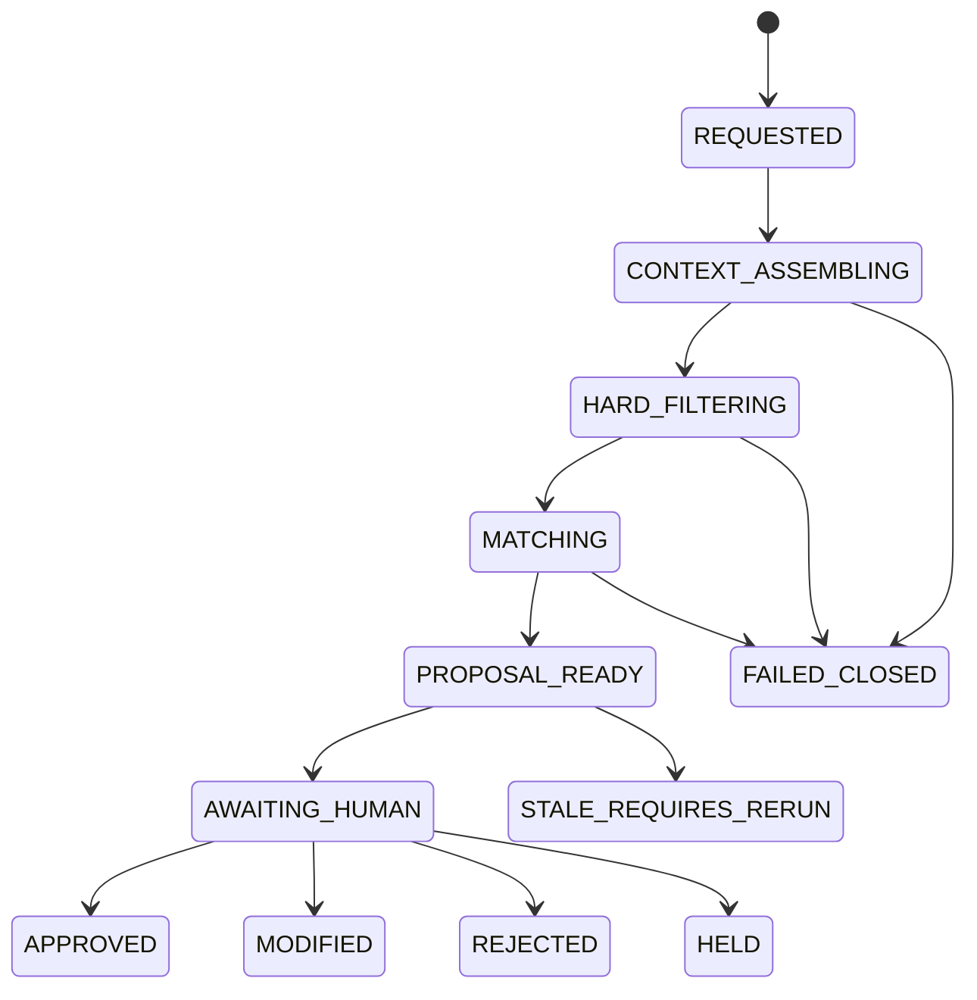
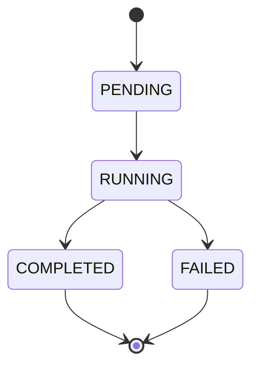

# DKWS ↔ GITS 产品推荐状态映射（WP1-3）

> 任务编号：WP1-3（双方 · 状态映射）
> 交付类型：CANDIDATE 设计文档（只新增本文件，不改动任何既有文件）
> 定位：承接《GITS_KERT_产品推荐三段式决策_详细落地方案_V1.0》§4.1 / §7.5 / §10，把 GITS 业务状态与 KERT 执行作业状态之间的映射固化下来，供合同设计（WP1）与领域实现（WP4）引用。

## 状态块

```text
STATUS=CANDIDATE
FROZEN=NO
IMPLEMENTED=NO
```

```json
{
  "documentId": "DKWS_GITS_STATE_MAPPING",
  "task": "WP1-3",
  "status": "CANDIDATE",
  "frozen": false,
  "implemented": false,
  "authority": "GITS_OWNS_BUSINESS_STATE"
}
```

---

## 0. 权威声明（先于一切映射成立）

1. **GITS 拥有业务状态权威。** `RecommendationRunStatus` 是产品推荐业务运行的唯一权威状态机，由 GITS Domain（`ProductRecommendationRun`）管理。
2. **KERT job 状态只是执行作业状态。** `PENDING / RUNNING / COMPLETED / FAILED` 描述的是 KERT 侧一次 Skill 执行作业的生命周期，不承载任何业务审批语义。
3. **无双重权威。** KERT 不得把 job 状态、`SkillExecuteResponse.status` 或任何错误码当作业务审批状态的第二权威源；GITS 也不得把 KERT job 状态直接透传成业务状态。KERT 仅输出技术/证据结果，业务状态的推进与迁移全部由 GITS Domain 裁决。

依据：

- 三段式方案 §4.1：「状态机应由 GITS Domain 管理。KERT 只维护 Skill 执行作业状态，不能成为业务审批状态的第二权威源。」
- 三段式方案 WP1 退出条件：「定义业务状态与 KERT job 状态映射 | 状态映射表 | **无双重权威状态**」。
- 三段式方案 §15 `ADR-PR-002`：「GITS 拥有业务 run 与人工决定；KERT 拥有 Skill 执行与证据结果。」
- DKWS OpenAPI `POST /api/skill/gates/audit` 已有同构先例：「业务闸门决策**镜像**（非权威）。权威状态机在 GITS。DKWS 仅追加记录到 `90_control/audit/gates.jsonl`。」

> 结论：本文件里「↔」箭头一律表示“观察/映射/触发”关系，**不是**双向等价。KERT 侧枚举的任何取值都不会改变 GITS 业务状态的权威性。

---

## 1. 状态映射表

### 1.1 四层枚举定义（各自闭集，互不混用）

| 层 | 拥有方 | 枚举闭集 | 语义定位 |
|---|---|---|---|
| 业务状态 `RecommendationRunStatus` | GITS（权威） | `REQUESTED / CONTEXT_ASSEMBLING / HARD_FILTERING / MATCHING / PROPOSAL_READY / AWAITING_HUMAN / APPROVED / MODIFIED / REJECTED / HELD / STALE_REQUIRES_RERUN / FAILED_CLOSED` | 一轮产品推荐业务运行的生命周期与人工决定 |
| 执行作业状态（KERT job） | KERT | `PENDING / RUNNING / COMPLETED / FAILED` | 一次异步 Skill 执行作业的技术生命周期 |
| 执行结果状态 `SkillExecuteResponse.status` | KERT | `ok / skill_error / exit_policy_no_new_evidence` | 一次 Skill 执行的技术/策略产出结论 |
| 业务错误码 `KERT_*` | KERT 输出，GITS 映射 | 见 §1.3（8 个） | 把 KERT 侧失败原因翻译为 GITS 处理动作的受控原因码 |

### 1.2 主映射表（12 个业务状态 × KERT 侧取值 × GITS 处理动作）

> 约定：`—` 表示该业务状态下无对应 KERT 取值；“（历史）”表示 KERT job 已终态、GITS 已持久化结果，后续不再有活跃 KERT 作业。`SkillExecuteResponse.status` 在异步模式下内嵌于 `JobStatusResponse.data.skill_result.status`，同步模式下为顶层字段。

| # | RecommendationRunStatus | KERT job 状态 | SkillExecuteResponse.status | 关联 KERT_* 错误码 | GITS 处理动作 |
|---|---|---|---|---|---|
| 1 | `REQUESTED` | `—`（尚未提交） | `—` | `—` | 幂等命中返回同一 run；校验 caller/权限/`asOf`/目的；准备 ContextPackage（SP-02），推进 `CONTEXT_ASSEMBLING` |
| 2 | `CONTEXT_ASSEMBLING` | `PENDING` / `RUNNING` | `—`（在途） | `KERT_CONTEXT_INSUFFICIENT` | 请求并校验受控 ContextPackage + EvidenceBundle；事实不足 → `HELD` + 生成核实任务 |
| 3 | `HARD_FILTERING` | `RUNNING` | `—`（在途） | `KERT_PERMISSION_DENIED` / `KERT_PRODUCT_KNOWLEDGE_STALE` / `KERT_RULE_VERSION_MISSING` / `KERT_EXECUTION_TIMEOUT` / `KERT_CONTRACT_MISMATCH` / `KERT_INTERNAL_ERROR` | 监控 job；按 §1.3 错误码映射推进；**禁止本地规则回退** |
| 4 | `MATCHING` | `RUNNING` | `—`（在途） | 同 `HARD_FILTERING` | 监控 job；按 §1.3 错误码映射推进；**禁止本地规则回退** |
| 5 | `PROPOSAL_READY` | `COMPLETED` | `ok` | （`KERT_EVIDENCE_INCOMPLETE` 会阻止进入本态） | 校验结果 + 内容哈希 + 证据覆盖（EvidenceBundle 必填项 100%）；固化不可变 `ProductRecommendationProposalVersion`；推进 `AWAITING_HUMAN`（创建 HG-D01） |
| 6 | `AWAITING_HUMAN` | `COMPLETED`（无活跃 job） | `ok`（历史） | `—` | 打开 HG-D01；决策载荷携带 `proposalVersion`/`If-Match`；批准前复核新鲜度，过期 → `STALE_REQUIRES_RERUN` |
| 7 | `APPROVED` | `COMPLETED`（终态） | `ok`（历史） | `—` | 记录 actor/time/reason；形成内部方案草案；**不写 CRM、不替代授信/定价/产品/合规审批** |
| 8 | `MODIFIED` | `COMPLETED`（终态；结构化修改为 GITS 本地，不新调 KERT） | `ok`（原始结果） | `—` | 生成新 `ProductRecommendationProposalVersion` + 结构化差异；保留旧版本；进入 G2 装配 |
| 9 | `REJECTED` | `COMPLETED`（终态） | `ok`（历史） | `—` | 记录驳回原因（缺失原因拒绝提交）；进入反馈/评测闭环，不直接改正式规则 |
| 10 | `HELD` | `COMPLETED` 或 `—`（取决于来源） | `skill_error`（早期事实不足）或 `ok`（人工暂缓） | `KERT_CONTEXT_INSUFFICIENT` | 生成核实任务/专家协同；可恢复继续；**不当作成功、不创建 HG-D01** |
| 11 | `STALE_REQUIRES_RERUN` | `COMPLETED`（旧结果仍在） | `ok`（旧结果，已失效） | `—`（由 GITS 上游变化触发，非 KERT 报错） | **不自动删除**；保留旧版本与差异；阻止旧方案批准；要求新建 run |
| 12 | `FAILED_CLOSED` | `FAILED` 或 `COMPLETED` + `skill_error` | `skill_error`（或 `exit_policy_no_new_evidence`） | `KERT_PERMISSION_DENIED` / `KERT_PRODUCT_KNOWLEDGE_STALE` / `KERT_RULE_VERSION_MISSING` / `KERT_CONTRACT_MISMATCH` / `KERT_INTERNAL_ERROR`（重试耗尽） | 按 §1.3 记录审计；除 `KERT_INTERNAL_ERROR` 先技术重试外不重试；**禁止本地假推荐** |

### 1.3 KERT_* 错误码 → GITS 处理动作（引用三段式方案 §7.5 与 SP-15 §6）

| KERT_* 错误码 | 语义 | 携带的 SkillExecuteResponse.status | GITS 业务状态 | GITS 处理动作（忠实引用 §7.5） |
|---|---|---|---|---|
| `KERT_PERMISSION_DENIED` | 权限不允许 | `skill_error` | `FAILED_CLOSED` | 不重试；记录权限审计（AC 同口径） |
| `KERT_CONTEXT_INSUFFICIENT` | 必须事实不足 | `skill_error` | `HELD` | 生成核实任务；不重试（§7.5 原文 `HELD/NEEDS_DATA` 落入 12 值枚举的 `HELD`） |
| `KERT_PRODUCT_KNOWLEDGE_STALE` | 产品知识版本失效 | `skill_error` | `FAILED_CLOSED` | 不重试；通知知识 Owner |
| `KERT_RULE_VERSION_MISSING` | 规则不可复现 | `skill_error` | `FAILED_CLOSED` | 不重试；规则复现失败 |
| `KERT_EXECUTION_TIMEOUT` | 技术超时 | （job 尚未终态，先查原 execution） | 保留当前在途状态 | **先查询原 execution 状态，不直接创建重复 job**；按策略用新 attemptId 重试；不启用本地推荐 |
| `KERT_CONTRACT_MISMATCH` | 输入/输出不符合合同 | `skill_error` | `FAILED_CLOSED` | 不重试；触发契约告警 |
| `KERT_EVIDENCE_INCOMPLETE` | 结果缺乏必要证据 | `skill_error`（或 `ok` 但证据不完整） | 不创建 HG-D01（不进 `AWAITING_HUMAN`，候选落 `HELD`） | **不创建 HG-D01**；要求补证据（对应 TC-PR-009） |
| `KERT_INTERNAL_ERROR` | 未分类技术错误 | `skill_error` | 技术重试后仍失败 → `FAILED_CLOSED` | 先技术重试（新 attemptId，复用快照），仍失败则关闭本轮 |

### 1.4 `exit_policy_no_new_evidence` 的边界（候选映射，待 Owner 裁决）

`exit_policy_no_new_evidence` 是 DKWS 通用状态（对齐 GITS 既有 `SkillExecutionStatus.EXIT_POLICY_NO_NEW_EVIDENCE`，语义为“策略终止：请求未携带新证据，拒绝伪生成新产出”），不是产品推荐专属错误码。候选处理：

- **重复/幂等请求**：GITS 在提交 KERT 前已按 §2.1 幂等键命中同一 run，不应触达 KERT；若仍收到该状态，视为“无新证据”，返回既有 run，不新生成方案。
- **首次运行**：表示本轮无法产生新推荐产出 → GITS **不创建 HG-D01、不当作成功**，候选落 `HELD`（等待补充事实/证据）。
- 该状态不落入 §1.3 任一 `KERT_*` 错误码，最终 GITS 目标状态（`HELD` vs `FAILED_CLOSED`）与是否允许自动重试，**列入 Owner 待裁决开放项**（见 §5，OQ-PR-SM-01）。

---

## 2. 幂等、重试、并发与过期（引用三段式方案 §10）

### 2.1 幂等范围

```text
caller + customerId + journeyId/operatingCaseId + objectiveHash + asOf + Idempotency-Key
```

- 同一幂等键重复请求返回**同一 run**，不重复调用 KERT（TC-PR-010；验收指标“同一幂等键重复执行：0”）。
- `asOf` 固化业务时点；`objectiveHash` 固化推荐目的，防止空泛“给我推荐产品”冒充同一运行。

### 2.2 重试

- 每次重试产生**新的 `attemptId`**，但保留**同一业务 run**，不覆盖旧轨迹。
- 技术重试默认**复用同一客户与知识快照**，避免结果漂移。
- 如需刷新事实或产品版本，**必须创建新的 proposal version** 并标记旧版本 `SUPERSEDED`。
- **GET 与页面刷新不得触发生成或重试**（Query 只读，副作用为零）。
- **KERT 超时后先查询原 execution 状态**，不能直接创建重复 job（TC-PR-011）。

### 2.3 并发

- HumanGate 决策必须携带 `proposalVersion` 或 `If-Match/ETag`。
- 两人同时审核时，**第二个过期提交返回 409**，不能覆盖第一人的决定。
- 持久化层对 `ProductRecommendationRun`/`ProductRecommendationProposalVersion` 做乐观锁（行级并发控制）。

### 2.4 过期触发清单 → `STALE_REQUIRES_RERUN`

发生以下任一变化，待审方案自动过期（三段式方案 §10.4，OQ-05 冻结后为最终清单）：

| 触发条件 | 对应对象/版本 | 处理 |
|---|---|---|
| Need 变化（核心客户事实被纠正） | `CustomerFactSnapshot` / `NeedProfile` | 待审方案过期，要求重跑 |
| ProductVersion 失效或关键条款更新 | `ProductKnowledgeSnapshot` | 待审方案过期，要求重跑 |
| 规则版本变化（硬规则） | `RuleBundle` / `RuleVersion` | 待审方案过期，要求重跑 |
| 权限撤销 | `permissionDecisionId` | 待审方案过期，要求重跑 |
| 经营目标改变 | `recommendationObjective` | 待审方案过期，要求重跑 |
| 超期（超过业务 Owner 定义的有效期） | run 有效期 | 待审方案过期，要求重跑 |

过期处理统一语义：

- 状态迁至 `STALE_REQUIRES_RERUN`。
- **不自动删除**：保留旧版本（`ProductRecommendationProposalVersion` 不可变）与新旧差异，审计可回放。
- 阻止旧方案被批准：`AWAITING_HUMAN` 阶段批准前必须复核新鲜度（TC-PR-012）。
- 重跑时创建新 run 或新 proposal version，不覆盖旧轨迹。

---

## 3. 状态机图（参照三段式方案 §4.1）

### 3.1 GITS 业务状态机（权威，12 状态，忠实复刻 §4.1）



补充语义（不改变 §4.1 权威图，仅作文字说明）：

- 终态：`APPROVED` / `MODIFIED` / `REJECTED` / `FAILED_CLOSED`。
- 可恢复：`HELD`（等待材料/客户确认/专业复核后恢复继续），`STALE_REQUIRES_RERUN`（旧版本保留，触发新 run）。
- `KERT_CONTEXT_INSUFFICIENT` 在 `CONTEXT_ASSEMBLING`/`HARD_FILTERING`/`MATCHING` 阶段均可把 run 转入 `HELD`；其余 `KERT_*` 错误按 §1.3 落入 `FAILED_CLOSED` 或保留在途重试。

### 3.2 KERT job 执行生命周期（非权威，仅执行作业状态）



说明：

- `COMPLETED` 时内嵌 `data.skill_result.status ∈ {ok, skill_error, exit_policy_no_new_evidence}`；`FAILED` 时携带 `error.code`（`KERT_*` 或通用错误码，见 DKWS OpenAPI `ErrorDetail.code`）。
- 该生命周期**只**被 GITS Adapter 观察（轮询 `/v1/jobs/{jobId}`），用于把执行结论映射回 §1.2 的业务状态，**不**承载业务状态本身。

---

## 4. 证据来源

| 引用 | 位置 |
|---|---|
| 三段式方案 §4.1（业务状态机 + “无第二权威源”） | `GITS_KERT_产品推荐三段式决策_详细落地方案_V1.0_20260831.md` L269–289 |
| 三段式方案 §7.5（8 个 KERT_* 失败码 → GITS 处理） | 同上 L514–526 |
| 三段式方案 §10（幂等/重试/并发/失效） | 同上 L592–626 |
| 三段式方案 §13.1 测试用例（TC-PR-010/011/012） | 同上 L730–734 |
| 三段式方案 WP1 任务（无双重权威状态） | 同上 L658 |
| 三段式方案 §15 ADR-PR-002 | 同上 L802 |
| SP-15 §6（失败码闭集，指向 GITS README §4） | `Leibniz-KERT/skills/product-recommendation/SP-15.md` L80–82 |
| AC-PRODUCT-RECOMMEND-001（权限/输入不足 → GITS 状态） | `Leibniz-KERT/skills/product-recommendation/activation-contracts/AC-PRODUCT-RECOMMEND-001.md` L30–34 |
| 推荐结果合同（EvidenceBundle 必填 + 五问） | `Leibniz-KERT/skills/product-recommendation/contracts/recommendation-result.md` |
| DKWS OpenAPI：job 状态枚举 / SkillExecuteResponse 枚举 / 错误码枚举 / 闸门镜像非权威说明 | `Leibniz-KERT/specs/dkws-openapi-v1.yaml`（`JobStatusResponse` L918–949、`SkillExecuteResponse` L610–634、`ErrorDetail` L1010–1036、`/api/skill/gates/audit` L291–321） |
| GITS 既有执行级状态枚举（对齐 wire status） | `gits-cbanking/scenario/execute/.../SkillExecutionStatus.java`（OK/SKILL_ERROR/EXIT_POLICY_NO_NEW_EVIDENCE） |
| 差异冲突与统一设计（D01 决定四态、上游变化触发 stale） | `GITS_Bank_本体智能体完整交接包_V1.0_20260831/01_客户服务建议书_产品解读_产品推荐_差异冲突与统一设计.md` §4.4 / §6 |

---

## 5. 如实报告的问题（先取证，不下结论）

1. **GITS 侧 step-3 契约尚未落地（与派工描述不一致）。** 派工称“已落地 SDD 契约（step 3）”，但实测 `gits-cbanking` 仓库：
   - `specs/product-recommendation/`（6 schema + README）**不存在**；
   - `specs/openapi/product-recommendation.openapi.json` **不存在**（`specs/openapi/` 下仅有 `gits-kno-api.openapi.json`）；
   - `specs/knowledge-architecture/activations/AC-PRODUCT-RECOMMEND-001.json` **不存在**（仅有 AC-FACT-RECONCILIATION-001 / AC-PREVISIT-001）；
   - `specs/CONTRACT_INDEX.yaml` 中 **无任何 `CTR-PR-*` 条目**；
   - `specs/knowledge-architecture/skills/SP-15.json` 存在，但仍为旧版 `1.1.0-p20`（未按 §18.1 升级输入输出/错误策略）。
   - DKWS 侧 step-3 文件齐全（`skills/product-recommendation/`、`specs/dkws-openapi-v1.yaml`、`skills/service-proposal/templates/ch07-product-recommendation.md`）。
   - 影响：本映射表的 GITS 权威枚举（`RecommendationRunStatus` 12 值）在 GITS 仓库尚无落地载体，本文件是**候选合同输入**，不是对已实现代码的映射。

2. **`exit_policy_no_new_evidence` 的 GITS 目标状态未在权威设计中明确。** 三段式方案 §7.5 只列出 8 个 `KERT_*` 码，未给出该通用状态的业务落点；本文件 §1.4 只能给出候选映射并挂 OQ-PR-SM-01。

3. **`KERT_EVIDENCE_INCOMPLETE` 的目标状态仅“不创建 HG-D01”。** §7.5 未命名其后置业务状态；本文件候选落 `HELD`，需 Owner 确认（vs `FAILED_CLOSED`）。

4. **既有 GITS 适配器存在本地回退路径，与新方案冲突。** `SkillExecutionException`/`FallbackSkillExecutionAdapter`（回落本地 `LlmClient`）是既有 `product-matching` 集成行为；三段式方案 ADR-PR-006 / INV-07 / §6.1 明确“KERT 失败禁止本地生产推荐 fallback”。新 `ProductRecommendationRun` 编排**不得**复用该回退路径。

5. **12 值枚举中的 `HELD` 吸收了两处来源。** 三段式方案 §7.5 写 `HELD/NEEDS_DATA`（上下文不足），§4.1 的 `HELD` 又是人工暂缓。二者在本文件统一为 `HELD`，但“补数据恢复”与“人工暂缓恢复”是否共用同一恢复路径，需 Owner 确认。

## 6. 状态块（重申）

```text
STATUS=CANDIDATE
FROZEN=NO
IMPLEMENTED=NO
```
